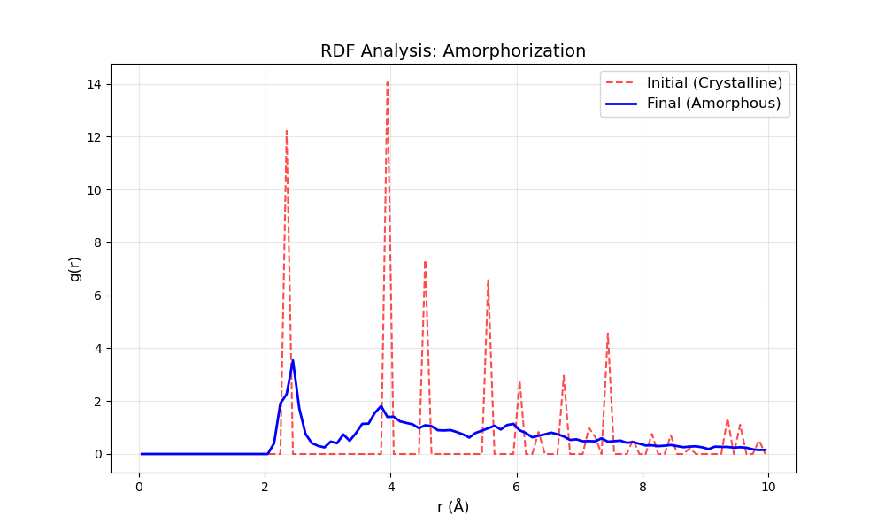

# LiCl Amorphorization Example

This example demonstrates the generation of amorphous LiCl from a crystalline starting point using a **Melt-Quench-Equilibrate** protocol with MLIPs (Machine Learning Interatomic Potentials).

## Overview
- **Material**: LiCl (Lithium Chloride)
- **Goal**: Generate an amorphous structure to study disordered properties.
- **Model**: `MACE-OMAT-0-small` (Foundation Potential)

## Protocol Steps

1.  **Preparation**:
    -   Started with crystalline LiCl.
    -   Generated a supercell (~100 atoms, $3\times3\times2$ expansion) to avoid periodicity artifacts.
    -   Input file: `crystalline_supercell.cif`

2.  **Melt-Quench Simulation**:
    -   **Stage 1: Melting**:
        -   Heated to **3000 K** for 10 ps.
        -   Thermostat: `nvt_langevin` (Robust temperature control).
    -   **Stage 2: Quenching**:
        -   Ramped temperature from **3000 K $\to$ 300 K** over 10 ps.
        -   Thermostat: `nvt_langevin` (using `set_temperature` for linear ramp).
    -   **Stage 3: Equilibration**:
        -   Relaxed at **300 K** for 5 ps.
        -   Thermostat: `nvt_bussi` (Bussi-Donadio-Parrinello) for accurate canonical sampling ($N, V, T$).
    -   **Tool**: `mcp_mace_run_md`

## Results

### Structure Analysis
-   **Final Structure**: `amorphous_final.cif`
-   **Density**: $\sim 1.66 \text{ g/cm}^3$
    -   Significant reduction from crystalline density ($\sim 2.07 \text{ g/cm}^3$), typical of amorphous solids.
-   **Coordination Number (CN)**: ~4.0
    -   Crystalline LiCl (Rocksalt) has CN=6.
    -   The reducted CN reflects the open, disordered network structure.

### Radial Distribution Function (RDF)
The RDF plot (`rdf_plot.png`) confirms the amorphous nature:
-   **First Peak (Li-Cl)**: Sharp peak at bond distance (~2.4 Å), preserving local order.
-   **Long-Range**: Absence of sharp peaks beyond the second neighbor shell, indicating loss of long-range lattice order.

