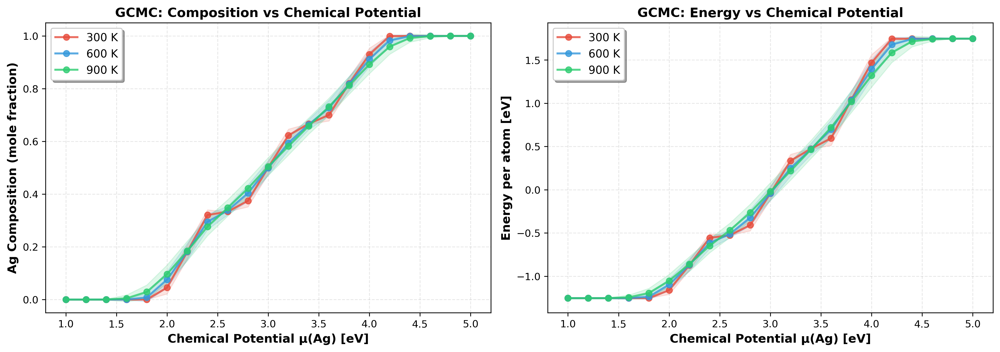
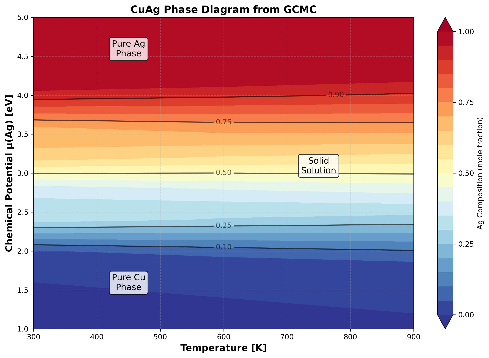

# CuAg GCMC Example

This example demonstrates Grand Canonical Monte Carlo (GCMC) simulation of Cu-Ag solid solution using a cluster expansion model.

## Quick Start

Run the full chemical potential sweep:

```bash
conda run -n smol-agent python ../../scripts/run_gcmc_sweep.py \
  --ce_file cluster_expansion.json \
  --element Ag \
  --supercell 3 3 3 \
  --temperatures 300 600 900 \
  --mu_min 1.0 --mu_max 5.0 \
  --num_mu_points 21 \
  --steps 15000 \
  --equilibration_steps 3000 \
  --output_dir gcmc_results/
```

## Expected Results

### Composition vs Chemical Potential



**Key transition points at T=300K:**
- μ = 2.0 eV → 10% Ag
- μ = 3.0 eV → 50% Ag (equimolar)
- μ = 4.0 eV → 90% Ag

### Temperature-μ Phase Diagram



The contour plot shows three distinct regions:
- **μ < 2 eV**: Pure Cu phase (blue)
- **2 < μ < 4.5 eV**: Solid solution (gradient)
- **μ > 4.5 eV**: Pure Ag phase (red)

## Analysis and Visualization

To analyze results and generate all plots:

```bash
conda run -n smol-agent python ../../scripts/analyze_gcmc_results.py \
  --results_file gcmc_results/results_summary.json \
  --output_dir gcmc_results/ \
  --element Ag
```

This generates:
- `mu_vs_composition.png` - Composition vs μ curves
- `energy_vs_mu.png` - Energy vs μ curves
- `phase_diagram.png` - T-x scatter plot
- `contour_phase_diagram.png` - T-μ contour plot

## Understanding Chemical Potentials

⚠️ **Important**: Chemical potentials in GCMC are **relative**, not absolute:

- `μ(Ag) = 0` does **NOT** mean equal Cu/Ag preference
- It represents a **bias term** relative to the cluster expansion's inherent energetics
- The CE's constant term already captures elemental reference energies
- Positive μ(Ag) favors Ag incorporation; negative μ(Ag) favors Cu

For this CuAg system:
- **μ < 2 eV**: Pure Cu favored
- **μ ≈ 3 eV**: Equal Cu-Ag mixture
- **μ > 4 eV**: Pure Ag favored

## Files

- `cluster_expansion.json` - Fitted CE model (9 clusters, RMSE ~0.02 eV)
- `training_data/` - MACE relaxation results used for CE training
- `gcmc_sweep_analysis.png` - Composition and energy vs μ plot

## Notes

- **Supercell size**: Use at least 3×3×3 to avoid finite-size effects
- **Equilibration**: 3000 steps recommended for Cu-Ag; increase for slower systems
- **Temperature effects**: Higher T broadens transitions due to thermal fluctuations
- **Convergence**: Monitor `std_composition` in output - should be < 0.05 for good statistics

## References

For detailed theoretical background on relative chemical potentials, see the project's `gcmc_chemical_potential_reference.md` artifact.
