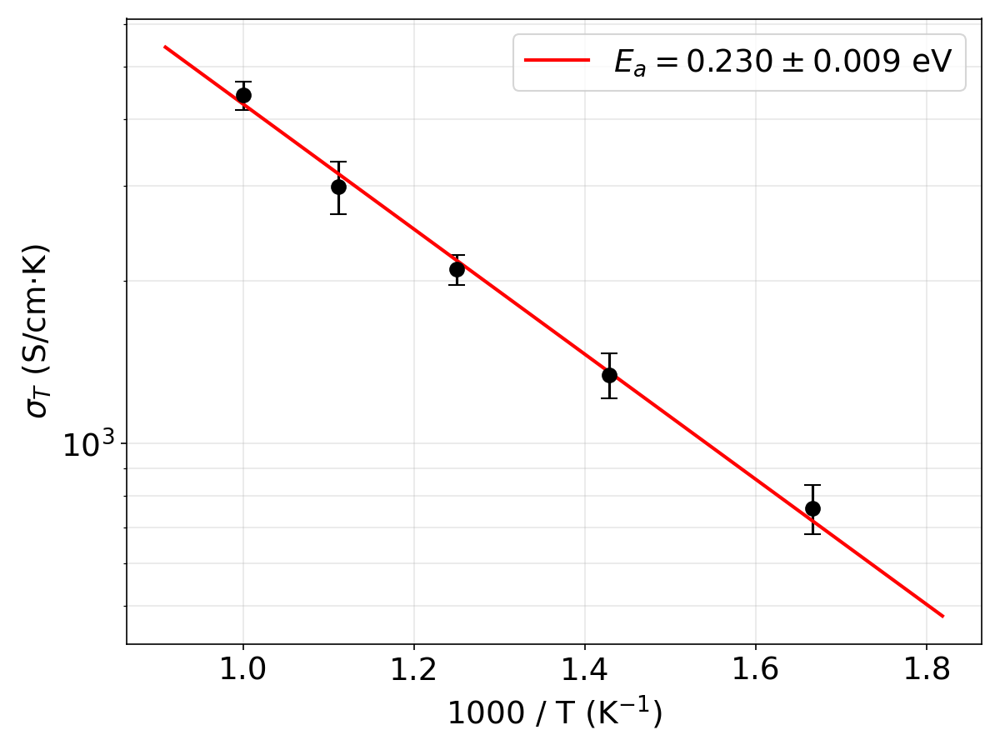

## Li-Ion Conductivity in β-Li₃PS₄

This example demonstrates the full `ionic-conductivity` workflow: converting Li tracer diffusivities into Nernst-Einstein conductivity and fitting the Arrhenius relation.

### Structure

- **Material**: β-Li₃PS₄ (Pnma, spacegroup 62)
- **Source**: Materials Project [`mp-985583`](https://next-gen.materialsproject.org/materials/mp-985583)
- **Supercell**: 1×1×2 → 64 atoms (24 Li, 8 P, 32 S), V = 1290.0 ų
- **File**: [Li3PS4_supercell.cif](Li3PS4_supercell.cif)

### Workflow

1. **Diffusion analysis** (upstream, via `diffusion-analysis` skill):
   - NVT MD at 600, 700, 800, 900, 1000 K using MACE-MP.
   - Li tracer diffusivity extracted from MSD with 5 ps equilibration skip.
   - Results in `md_<T>K/diffusion_results.json`.

2. **Ionic conductivity** (this skill):
   ```bash
   # Env: base-agent
   for T in 600 700 800 900 1000; do
       python .agent/skills/ionic-conductivity/scripts/compute_ionic_conductivity.py \
           --structure Li3PS4_supercell.cif \
           --diffusion_json md_${T}K/diffusion_results.json \
           --charges "Li=1" \
           --out md_${T}K/conductivity.json
   done
   ```

3. **Arrhenius fit**:
   ```bash
   # Env: base-agent
   python .agent/skills/ionic-conductivity/scripts/fit_arrhenius_conductivity.py \
       md_600K/conductivity.json md_700K/conductivity.json md_800K/conductivity.json \
       md_900K/conductivity.json md_1000K/conductivity.json \
       --out arrhenius_conductivity.json
   ```

### Results

| T (K) | D (cm²/s)  | σ_NE (S/cm) |
|--------|-----------|-------------|
| 600    | 2.19e-05  | 1.26        |
| 700    | 3.88e-05  | 1.92        |
| 800    | 6.08e-05  | 2.63        |
| 900    | 8.67e-05  | 3.33        |
| 1000   | 1.28e-04  | 4.42        |

- **Activation Energy (E_a)**: **0.230 ± 0.009 eV**
- **Extrapolated σ(300 K)**: ~2.8 × 10⁻² S/cm (from Arrhenius fit)



### Comparison with Literature

| Source | Method | E_a (eV) | σ at RT (S/cm) | Notes |
|--------|--------|----------|---------------|-------|
| Liu et al., *JACS* (2013) | Experiment (EIS) | 0.356 | 1.64 × 10⁻⁴ | Nanoporous β-Li₃PS₄ |
| Forrester et al., *Chem. Mater.* (2022) | Classical MD, 14k atoms, 10 ns | 0.41 | — | Kim et al. potentials; 1% Li vacancies |
| Forrester et al. (stoichiometric) | Classical MD | 0.40 | — | No vacancies |
| **This example (NE, extrapolated)** | **MACE-MP, 64 atoms, NE** | **0.230** | **~2.8 × 10⁻²** | **H_R = 1 assumed** |

Our E_a (0.23 eV) is significantly lower than Forrester et al.'s 0.41 eV and experimental values (0.30–0.50 eV). Our extrapolated RT conductivity overshoots experiments by ~2 orders of magnitude. These discrepancies are expected and instructive:

1. **System size and trajectory length**: Forrester et al. use ~14,000 atoms and 10 ns trajectories. Our 64-atom cell and shorter runs can artificially flatten the energy landscape; prior AIMD on α-Li₃PS₄ with similar small cells yielded E_a ≈ 0.18 eV, which the paper attributes to insufficient sampling.

2. **NE neglects correlations**: A central finding of Forrester et al. is that Li–Li correlation is pivotal for β-Li₃PS₄ — the interatomic Li–Li interaction restricts diffusion. Removing the short-range Li–Li potential dramatically increases D. Our NE approximation (H_R = 1) ignores these correlations entirely, overestimating conductivity.

3. **PS₄ librational dynamics**: The paper shows PS₄ libration enhances Li diffusion; tethering PS₄ groups raises E_a from 0.41 to 0.72 eV. Whether MACE-MP captures these dynamics in a 64-atom cell is an open question.

4. **Arrhenius curvature**: Our simulations span 600–1000 K (Forrester et al. cover 400–1000 K). The true E_a at lower T is steeper (~0.35–0.50 eV experimentally). Extrapolating a shallow high-T slope to 300 K overshoots.

5. **Foundation potential accuracy**: MACE-MP-small is a general-purpose potential; fine-tuned or DFT-specific models improve quantitative agreement.

To improve agreement, the paper's methodology suggests: larger supercells, longer trajectories (≥10 ns), including temperatures down to 400 K, and computing distinct-part diffusion coefficients (not just tracer/self) to obtain a physical Haven ratio correction.

**Reference**: Forrester, F. N.; Quirk, J. A.; Famprikis, T.; Dawson, J. A. *Chem. Mater.* **2022**, *34*, 10561–10571. DOI: [10.1021/acs.chemmater.2c02637](https://doi.org/10.1021/acs.chemmater.2c02637)

### Files

- `Li3PS4_supercell.cif`: 1×1×2 supercell from `mp-985583`.
- `md_<T>K/diffusion_results.json`: Tracer diffusivities (input from `diffusion-analysis`).
- `md_<T>K/conductivity.json`: NE conductivity at each temperature.
- `arrhenius_conductivity.json`: Arrhenius fit results (E_a, prefactor).
- `arrhenius_conductivity_plot.png`: Publication-quality Arrhenius plot.
