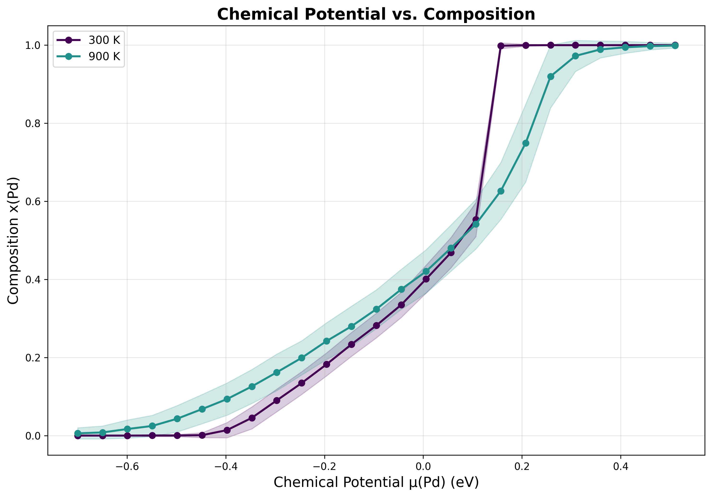
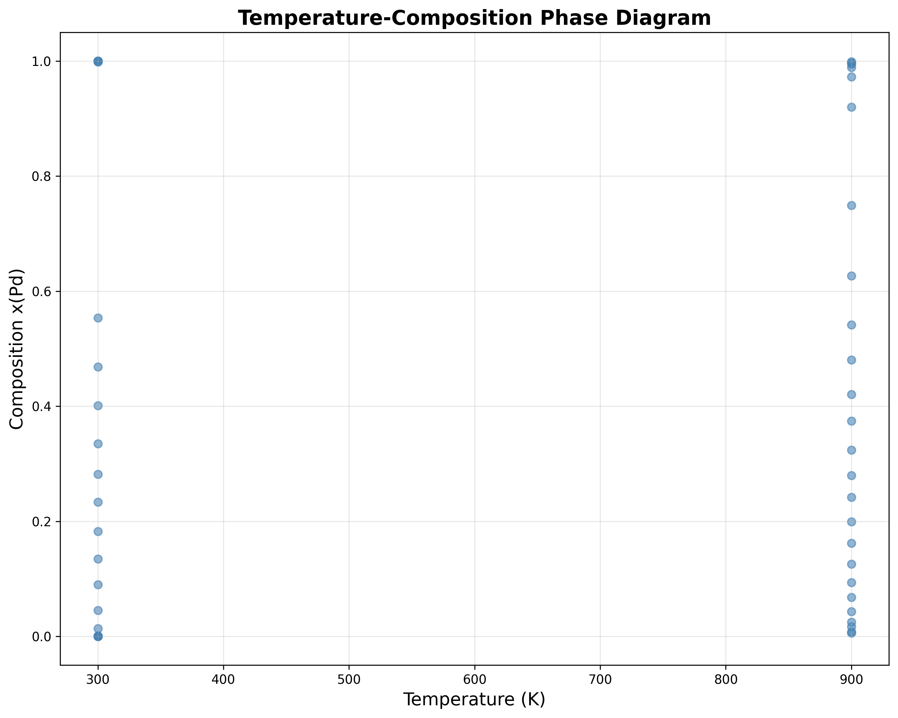

# AgPd GCMC Example

This example adapts the [icet AgPd tutorial](https://icet.materialsmodeling.org/get_started/run_monte_carlo.html) demonstrating how to map out a phase diagram using Semi-Grand Canonical (SGC) Monte Carlo sampling on a trained Cluster Expansion (CE) in `smol`.

## Quick Start

Run the full chemical potential sweep:

```bash
conda run -n smol-agent python ../../scripts/run_gcmc_sweep.py \
    --ce_file ../../../ml-cluster-expansion/examples/AgPd_DFT_CE/cluster_expansion.json \
    --supercell 3 3 3 \
    --temperatures 300 900 \
    --mu_min -0.7 \
    --mu_max 0.51 \
    --num_mu_points 25 \
    --steps 30000 \
    --equilibration_steps 5000 \
    --element Pd \
    --output_dir gcmc_results/
```

## Expected Results

### Composition vs Chemical Potential and Phase Diagram

 

**Key transition points at T=300K:**
- There is a clear discontinuity in composition between 0.55 and 1.0, indicating a miscibility gap. Note that for `phase_diagram.png`, you can sample at more temperatures to get the complete miscibility gap.

## Analysis and Visualization

To analyze results and generate all plots:

```bash
conda run -n smol-agent python ../../scripts/analyze_gcmc_results.py \
    --results_file gcmc_results/results_summary.json \
    --output_dir ./ \
    --element Pd
```

This generates:
- `mu_vs_composition.png` - Composition vs μ curves
- `energy_vs_mu.png` - Energy vs μ curves
- `phase_diagram.png` - T-composition phase diagram
- `contour_phase_diagram.png` - T-μ contour plot

## Understanding Chemical Potentials

⚠️ **Important**: Chemical potentials in GCMC are **relative**, not absolute:

- `μ(Pd) = 0` does **NOT** mean equal Ag/Pd preference
- It represents a **bias term** relative to the cluster expansion's inherent energetics
- The CE's constant term already captures elemental reference energies
- Positive μ(Pd) favors Pd incorporation; negative μ(Pd) favors Ag

## Files

- `cluster_expansion.json` - Fitted CE model from `ml-cluster-expansion` skill


## Notes

- **Supercell size**: Use at least 3×3×3 to avoid finite-size effects
- **Equilibration**: 5000 steps recommended for this example
- **Convergence**: Monitor `std_composition` in output - should be < 0.05 for good statistics

## References
1. [icet AgPd MC](https://icet.materialsmodeling.org/get_started/run_monte_carlo.html)
1. [icet Paper](https://arxiv.org/abs/1901.08790)
