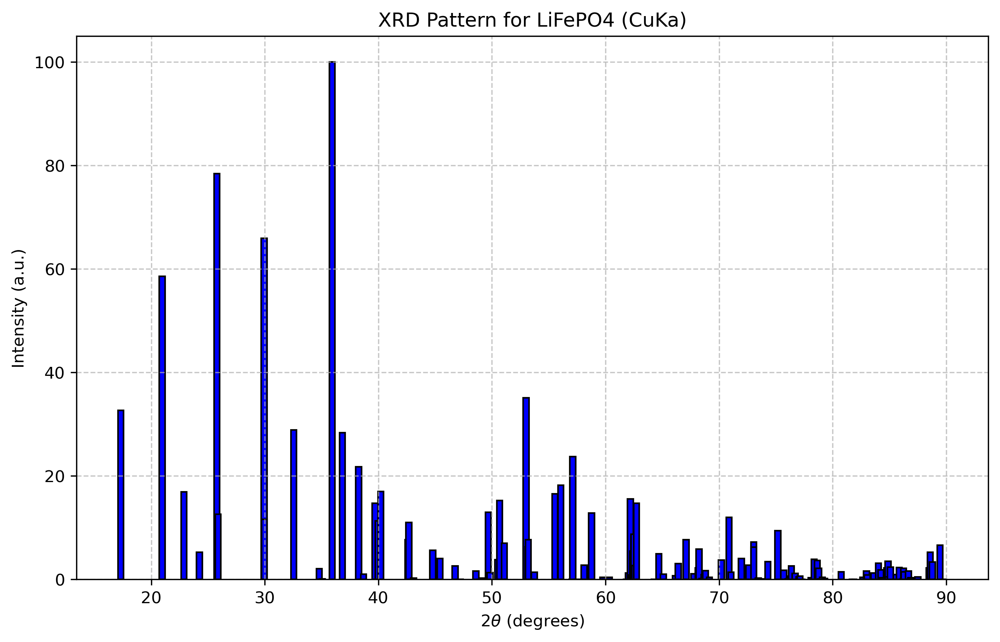

# LiFePO4 XRD Example

This example demonstrates how to calculate the XRD pattern for LiFePO4 (Olivine structure).

## Files

- `LiFePO4.cif`: The crystal structure of LiFePO4 obtained from Materials Project.
- `LiFePO4_xrd.json`: Calculated diffraction data.
- `LiFePO4_xrd.png`: Plot of the XRD spectrum.

## How to run

To reproduce the results, run the following command from the project root:

```bash
conda activate base-agent
python .agent/skills/mat-xrd-spectrum/scripts/calculate_xrd.py .agent/skills/mat-xrd-spectrum/examples/LiFePO4/LiFePO4.cif --output_dir .agent/skills/mat-xrd-spectrum/examples/LiFePO4/
```

## Results

The calculated XRD pattern shows the characteristic peaks for the Pnma space group of LiFePO4.


