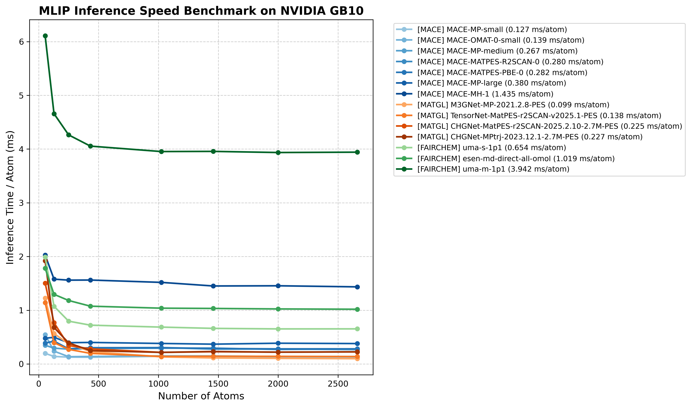
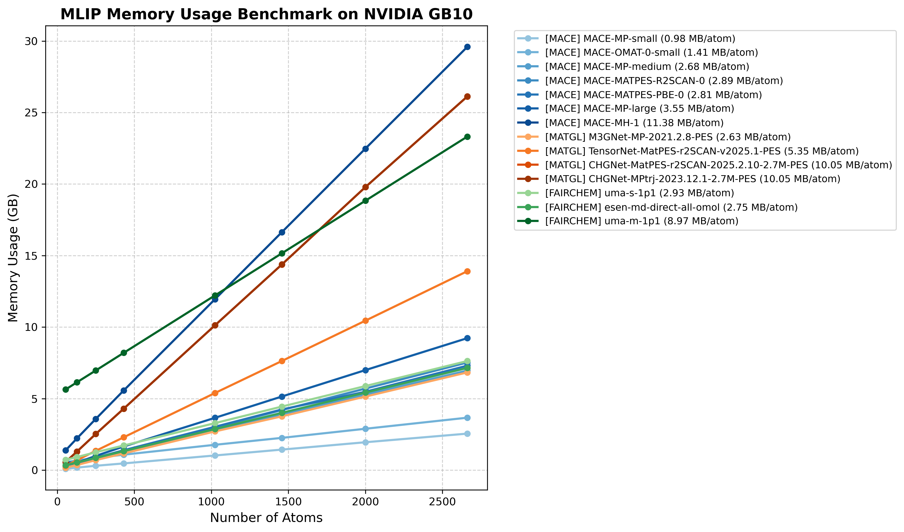

# MLIP Performance Benchmarking

## Goal
Evaluate and compare the inference speed (latency) and memory consumption of various foundation MLIP models to determine their suitability for different simulation scales and timescales.

## Benchmark Script

The `benchmark_mlips.py` script measures performance by running short MD simulations on NaCl supercells of varying sizes.

### Usage

Run the script within the appropriate conda environment for the models being tested. The script automatically skips models not supported by the current environment.

### Multi-Environment Benchmarking

Because different MLIPs require isolated Conda environments (e.g., `mace-agent`, `matgl-agent`, `fairchem-agent`), the benchmark results are built incrementally. 

1. **Run the script in each environment:** The script gracefully skips models whose libraries are missing while preserving and updating the central `speed_benchmark.yaml` file.
2. **Consolidate:** Run the script in any environment (that has `matplotlib`) with the `--only_plot` flag to generate the combined graphs from the accumulated total data.

```bash
# Example: Running in different environments sequentially
/path/to/mace-python benchmark_mlips.py --output_dir results/
/path/to/matgl-python benchmark_mlips.py --output_dir results/
/path/to/fairchem-python benchmark_mlips.py --output_dir results/

# Generate final combined plots
python benchmark_mlips.py --only_plot --output_dir results/
```

**Key Arguments:**
- `--models`: List of model names/checkpoints to benchmark.
- `--providers`: Corresponding providers (`mace`, `matgl`, `fairchem`).
- `--output_dir`: Directory to save results and plots.
- `--max_atoms_limit`: Maximum system size to test (default: 5000).
- `--only_plot`: Re-generate plots from an existing `speed_benchmark.yaml` file without running simulations.

### Metrics Explained
- **Inference Time / Atom (ms):** The normalized time taken for a single force/energy calculation per atom. Converged values (for larger systems) provide the best comparison.
- **Memory Usage / Atom (MB):** The peak VRAM footprint per atom. Useful for predicting OOM (Out Of Memory) limits for large supercells.

## Typical Performance (NVIDIA GB10)

Performance benchmarks conducted on **NVIDIA GB10** reveal distinct performance tiers:

- **High Speed / Low Cost:** Models like `M3GNet` and `TensorNet` scale efficiently to large systems (>10,000 atoms) with very low latency (~0.1 ms/atom).
- **Intermediate:** `MACE` small/medium models and `eSEN` models occupy the mid-range (~0.3 - 1.0 ms/atom).
- **High Accuracy / High Cost:** `MACE-MH-1` and `UMA-medium` are heavier (~1.5 - 4.0 ms/atom), making them ideal for static calculations or small-scale MD.

### Optimal System Size and Overhead

> [!IMPORTANT]
> **Constant Overhead:** MLIP inference on GPUs has a significant constant overhead (fixed cost regardless of system size). For very small systems (<100 atoms), the inference time per atom is dominated by this overhead, resulting in poor efficiency.
>
> **Best Practice:** For capturing chemical rare events or maximizing throughput, it is more efficient to use larger cells of **~500 atoms**. At this size, the constant overhead is amortized, allowing the MLIP to operate closer to its peak theoretical throughput while providing a larger volume for sampling transitions.




> [!TIP]
> Use these results to select models for long MD simulations or large-scale screening. For systems >1000 atoms, prioritize models with latency < 0.5 ms/atom if ns-scale MD is required.

## Resources
- [Example Benchmark Data (NVIDIA GB10)](resources/speed_benchmark_dgx_spark.yaml)
---

**Author:** Bowen Deng  
**Contact:** [GitHub @bowen-bd](https://github.com/bowen-bd)
