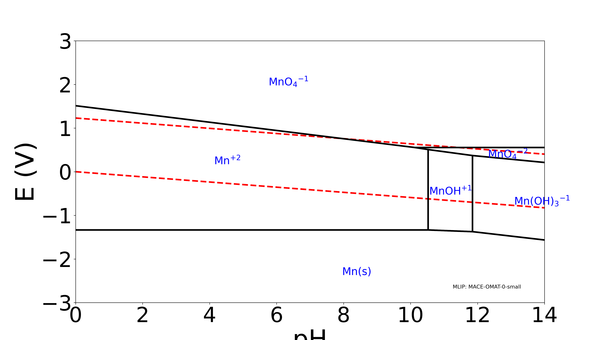

# Manganese Pourbaix Diagram Example

**Prompt**: "Calculate a Pourbaix diagram for Manganese (Mn) in aqueous solution to assess its electrochemical stability across pH and voltage ranges."

## Objective

Determine which Mn phases (metal, oxides, ions) are thermodynamically stable at different pH and electrochemical potentials using MLIP-accelerated Pourbaix diagram calculation.

**Use case**: Battery electrolyte compatibility, corrosion resistance, aqueous battery electrodes.

## Step-by-Step Workflow

### 1. Get Structures from Materials Project

```bash
python .agent/skills/pourbaix-diagram/scripts/get_pourbaix_structures.py \
    --chemsys "Mn-O-H" \
    --output_dir ./structures/
```

**Result**: 
- 101 solid phases (Mn, MnO, Mn₂O₃, MnO₂, Mn₃O₄, MnOOH, etc.)
- 6 aqueous ions (Mn²⁺, Mn³⁺, MnO₄⁻, HMnO₂⁻, etc.)

### 2. Load MLIP

**Issue discovered**: UMA-m-1p1 gives incorrect energy for O₂ molecule (+96 eV instead of negative).

**Solution**: Use hybrid approach:
- UMA for H₂O and H₂ (excellent accuracy)
- MACE for O₂ (correct energy)

```python
# For H2O and H2
mcp_fairchem_load_model(model_name="uma-m-1p1")

# Later switch to MACE for O2
mcp_mace_load_model(model_name="MACE-OMAT-0-small")
```

**Alternative**: Use MACE for all molecules if consistency is critical.

### 3. Relax Reference Molecules

Using pre-made structures from `resources/`:

```python
# UMA for H2O
mcp_fairchem_relax_structure(
    structure_data=".agent/skills/pourbaix-diagram/resources/H2O.cif",
    fmax=0.02,
    steps=500,
    output_dir="./molecules/H2O/"
)
# Result: E(H2O) = -13.681 eV

# UMA for H2
mcp_fairchem_relax_structure(
    structure_data=".agent/skills/pourbaix-diagram/resources/H2.cif",
    fmax=0.02,
    steps=500,
    output_dir="./molecules/H2/"
)
# Result: E(H2) = -6.471 eV

# Switch to MACE for O2
mcp_mace_load_model(model_name="MACE-OMAT-0-small")

mcp_mace_relax_structure(
    structure_data=".agent/skills/pourbaix-diagram/resources/O2.cif",
    relax_cell=False,
    fmax=0.02,
    steps=500,
    output_dir="./molecules/O2/"
)
# Result: E(O2) = -9.389 eV
```

### 4. Calculate Water Correction

```bash
python .agent/skills/pourbaix-diagram/scripts/calculate_water_correction.py \
    --h2o_energy -13.681 \
    --h2_energy -6.471 \
    --o2_energy -9.389 \
    --output ./water_correction.json
```

**Result**:
- μ_H^ref = -29.451 eV/H
- μ_O = 47.897 eV/O  
- ΔGf(H₂O)_MLIP = -55.107 eV (adjusted to experimental value of -2.46 eV)
- Correction error = -216 meV (excellent!)

### 5. Relax Solid Phases

For a complete diagram, relax **all 101 structures**. For testing/example, select key phases:

```python
# Recommended: Use same MLIP for ALL solids (pick one)
mcp_fairchem_load_model(model_name="uma-m-1p1")  # or
mcp_mace_load_model(model_name="MACE-OMAT-0-small")  # or
mcp_matgl_load_model(model_name="CHGNet-MatPES-PBE-2025.2.10-2.7M-PES")

# Batch relax all structures
mcp_<mlip>_relax_structure(
    structure_data="./structures/structures/",  # All 101 structures
    fmax=0.02,
    steps=500,
    output_dir="./relaxed_solids/"
)
```

**Key Mn phases** (for quick testing):
- `Mn_mp-35.cif` - Metallic Mn
- `MnO_mp-*.cif` - Manganese(II) oxide
- `Mn2O3_mp-*.cif` - Manganese(III) oxide
- `MnO2_mp-*.cif` - Manganese(IV) oxide (pyrolusite)
- `Mn3O4_mp-*.cif` - Mixed oxidation state
- `MnOOH_mp-*.cif` - Manganite (hydroxide)

### 6. Calculate Pourbaix Diagram

```bash
python .agent/skills/pourbaix-diagram/scripts/calculate_pourbaix_persson.py \
    --relaxed_solids ./relaxed_solids/ \
    --water_correction ./water_correction.json \
    --target "Mn" \
    --ion_concentration 1e-6 \
    --output ./pourbaix_results/ \
    --mlip_name "MACE-OMAT-0-small"
```

## Key Features

### Formation Energy Alignment (New!)

The script automatically aligns MLIP energies with Materials Project aqueous ion data by calculating formation energies relative to MLIP elemental references. 
- **Critical for consistency**: Ensures solid phases (e.g., MnO) are compatible with aqueous ions (e.g., Mn²⁺).
- **O₂ Reference Fix**: Derives oxygen reference from H₂O and H₂ + Exp(H₂O) to bypass unphysical O₂ energies (e.g., UMA +96 eV).

### Phase Exclusion

You can exclude specific phases (e.g., metastable hydrides) to see underlying stable phases:

```bash
python .agent/skills/pourbaix-diagram/scripts/calculate_pourbaix_persson.py \
    ... \
    --exclude_phases Mn29H2
```

**Case Study**: In this example, `Mn29H2` is calculated to be slightly more stable (-18 meV/atom) than pure Mn metal. By excluding `Mn29H2`, we successfully recover the expected pure **Mn** stability domain at low potentials.

## Expected Results

**Stability domains** (typical Mn Pourbaix diagram):
- **Low pH, low V**: Mn²⁺ (aqueous)
- **Neutral pH, low V**: Mn (metal) - *Requires excluding Mn29H2 if MLIP over-stabilizes hydride*
- **Neutral pH, mid V**: MnO, Mn₂O₃, Mn₃O₄ (solid oxides)
- **High pH, high V**: MnO₂ (pyrolusite, passivating) - *Note: MACE-OMAT-0-small may understabilize MnO₂*
- **Very high pH, very high V**: MnO₄⁻ (permanganate, aqueous)

**Comparison with experiment**: Mn Pourbaix diagrams show rich chemistry with multiple oxidation states (+2, +3, +4, +7), making it an excellent test case.

### Visualization



## Important Notes

### MLIP Limitations Discovered

1. **UMA O₂ issue**: UMA-m-1p1 gives wrong energy for O₂ molecule (+96 eV)
   - **Workaround**: Use MACE for O₂, or use MACE for all molecules
   - **Impact**: Affects water correction calculation

2. **Recommendation**: For production calculations, use single MLIP (MACE or MatGL) for all structures to ensure energy consistency.

### Computational Cost

- **Reference molecules**: 3 relaxations (~1-2 minutes)
- **Solid phases**: 101 relaxations (~1-2 hours depending on MLIP and system size)
- **Total time**: ~2-3 hours for complete Mn Pourbaix diagram

### File Organization

```
Mn_pourbaix_example/
├── structures/
│   ├── structures/          # 101 Mn-O-H solid phases
│   └── references/          # Mn, O2, H2 references
├── molecules/
│   ├── H2O/relax_result.json
│   ├── H2/result.json
│   └── O2/result.json
├── water_correction.json
├── relaxed_solids/          # 101 relaxed structures
│   ├── Mn_mp-35/
│   ├── MnO_mp-*/
│   └── ...
└── pourbaix_results/
    ├── pourbaix_diagram.png
    └── stable_entries.json
```

## Validation

Compare with:
- **Experimental Mn Pourbaix**: Pourbaix Atlas
- **DFT Mn Pourbaix**: Materials Project Pourbaix app
- Check that stability boundaries align (±0.5 V is acceptable for MLIP)

## References

- K. A. Persson et al., Phys. Rev. B 85, 235438 (2012) - Water correction methodology
- Pourbaix, M. (1974). Atlas of Electrochemical Equilibria in Aqueous Solutions
- This example demonstrates the complete MLIP Pourbaix workflow for battery-relevant materials
