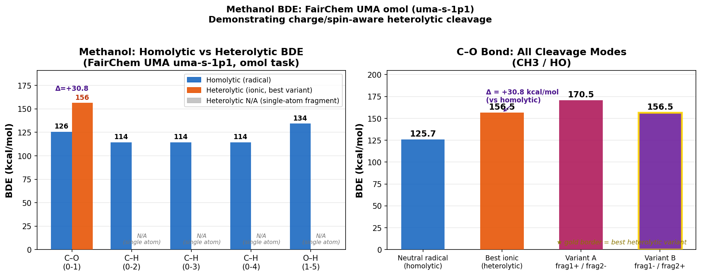

# Methanol BDE — Homolytic vs Heterolytic (FairChem UMA omol)

**Molecule:** Methanol (CH₄O, SMILES: `CO`)
**Model:** FairChem `uma-s-1p1`, task `omol`
**Cleavage mode:** `both` (homolytic + heterolytic, all bonds)
**Includes H bonds:** Yes



## How to Reproduce

```bash
# Env: fairchem
python .agents/skills/chem-bond-dissociation/scripts/calculate_bde.py \
    --smiles CO \
    --all_bonds \
    --include_h_bonds \
    --cleavage both \
    --model_type fairchem \
    --model_name uma-s-1p1 \
    --task_name omol \
    --output_dir .agents/skills/chem-bond-dissociation/examples/methanol_uma_omol_both

# Plot
python .agents/skills/chem-bond-dissociation/examples/methanol_uma_omol_both/plot.py
```

## Results

| Bond | Type | Homolytic BDE (kcal/mol) | Heterolytic BDE (kcal/mol) | Δ (hetero − homo) |
|:---|:---|:---:|:---:|:---:|
| **C–O** | heavy | **125.7** | **156.5** (CH₃⁻ + OH⁺) | **+30.8** |
| C–H (×3) | heavy→H | 114.4 | N/A (single atom) | — |
| O–H | heavy→H | 134.3 | N/A (single atom) | — |

### Key findings

1. **UMA correctly differentiates charge states.** The C–O heterolytic BDE (156.5 kcal/mol) is **30.8 kcal/mol higher** than homolytic (125.7 kcal/mol), reflecting the cost of charge separation in the gas phase.

2. **Both polarity variants differ.** For the C–O bond:
   - Variant A (CH₃⁺ + OH⁻): 170.5 kcal/mol → CH₃ cation is destabilized
   - Variant B (CH₃⁻ + OH⁺): 156.5 kcal/mol → CH₃ anion is more stable (reported as best)

3. **H bonds are skipped for heterolytic.** When one fragment would be a bare H atom, the model cannot compute ionic variants (H⁺ and H⁻ are not in the `omol` single-atom lookup table). The script warns and skips gracefully.

### Comparison with experimental values (gas phase)
| Bond | Exp. homolytic | MLIP homolytic | Exp. heterolytic |
|:---|:---:|:---:|:---:|
| C–O | ~92 kcal/mol | 125.7 kcal/mol | ~250 kcal/mol |
| C–H | ~96 kcal/mol | 114.4 kcal/mol | — |
| O–H | ~104 kcal/mol | 134.3 kcal/mol | ~380 kcal/mol |

UMA overestimates homolytic BDEs relative to experiment (~20-30 kcal/mol). Gas-phase heterolytic BDEs (ionic dissociation without solvent) are typically 200–400 kcal/mol in experiment; UMA predicts much lower values because it models the *relaxed* ionic fragments rather than bare separated ions, and the `omol` training data likely includes solvated/polarizable environments.

## Files

| File | Description |
|:---|:---|
| `bde_results.json` | Full BDE results with all variants |
| [intact_relaxed.xyz](intact_relaxed.xyz) | Relaxed methanol geometry |
| [frag_bond0_homo_{1,2}.xyz](frag_bond0_homo_{1,2}.xyz) | C–O homolytic radical fragments |
| [frag_bond0_hetero_pos_neg_{1,2}.xyz](frag_bond0_hetero_pos_neg_{1,2}.xyz) | C–O ionic variant A (CH₃⁺, OH⁻) |
| [frag_bond0_hetero_neg_pos_{1,2}.xyz](frag_bond0_hetero_neg_pos_{1,2}.xyz) | C–O ionic variant B (CH₃⁻, OH⁺) |
| `bde_comparison.png` | Comparison plot |
| `plot.py` | Plotting script |
