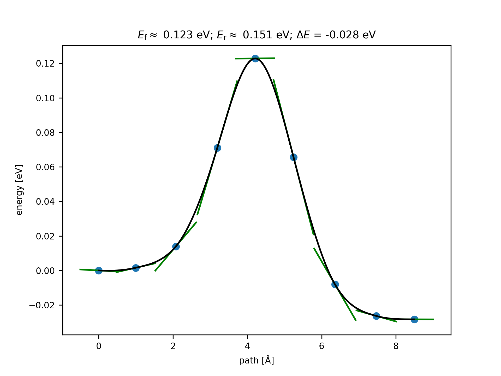

# Butane Conformational NEB Example

A textbook NEB example: rotation around the central C–C bond in n-butane (C₄H₁₀), converting between gauche and anti conformations. No bonds are broken or formed.

## Reaction

```
gauche (60°) ──→ eclipsed TS (~120°) ──→ anti (180°)
```

The transition state is an eclipsed conformation where eclipsing strain raises the energy.

## Files

| File | Description |
|------|-------------|
| [anti_butane.xyz](anti_butane.xyz) | Anti conformation (dihedral 180°), generated by RDKit MMFF |
| [gauche_butane.xyz](gauche_butane.xyz) | Gauche conformation (dihedral ~65°), generated by RDKit MMFF |
| `run_example.py` | NEB calculation script |
| `output/neb_results.json` | Energies, barriers, dihedrals |
| `output/neb_barrier_plot.png` | Energy profile plot |
| [output/neb_path.xyz](output/neb_path.xyz) | Full NEB path (XYZ trajectory) |
| [output/ts_neb.xyz](output/ts_neb.xyz) | Transition state structure |

## Usage

```bash
conda activate mace-agent
cd <project_root>
python .agents/skills/chem-neb-barrier/examples/butane_conformer/run_example.py
```

## Results (MACE-OFF23-small)

| Property | Value |
|----------|-------|
| Forward barrier (gauche → anti) | 0.123 eV (2.83 kcal/mol) |
| Reverse barrier (anti → gauche) | 0.151 eV (3.49 kcal/mol) |
| Energy difference (gauche − anti) | 0.028 eV (0.65 kcal/mol) |
| TS dihedral (C-C-C-C) | −120° |
| NEB converged | Yes |
| Literature barrier | ~0.15 eV (3.4 kcal/mol) |

The MACE-OFF23-small barrier (0.123 eV) is in reasonable agreement with the experimental/CCSD(T) value of ~0.15 eV.

## Energy Profile



## Notes

- Structures are generated with RDKit (MMFF94 force field) to ensure proper conformations
- IDPP interpolation works well for conformational changes (no bond breaking)
- 7 intermediate images provide smooth path resolution
- CI-NEB converges within 300 steps
