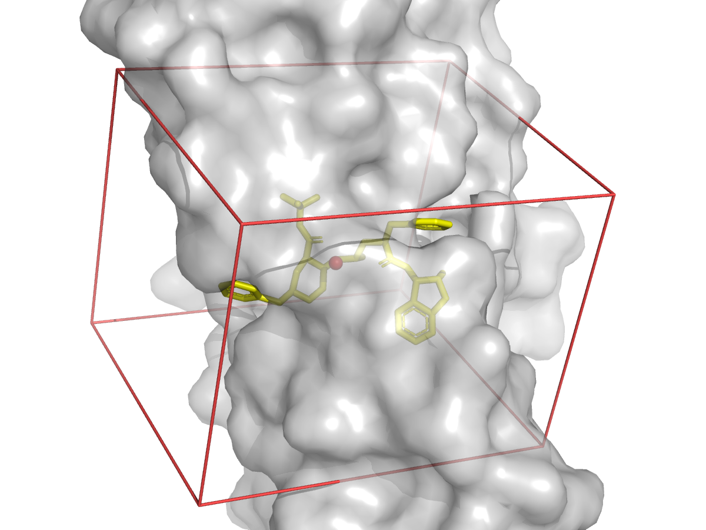

# HIV-1 Protease Binding Site Definition (PDB 1HSG)

## Goal
Demonstrate all three binding-site definition modes using the HIV-1 protease co-crystal structure (PDB 1HSG) with the MK1 inhibitor.

## Input Files
- `1HSG_raw.pdb`: full PDB structure downloaded via PDBFixer
- `1HSG_protein.pdb`: protein-only (ATOM records)
- `MK1_ligand.pdb`: co-crystal ligand MK1 (chain B HETATM records)

## Steps

### Mode A: Box from co-crystal ligand

```bash
# Env: drugdisc-agent
python .agents/skills/drug-binding-site-definition/scripts/define_binding_site.py \
  --mode ligand \
  --ligand_file .agents/skills/drug-binding-site-definition/examples/hiv1-protease/MK1_ligand.pdb \
  --padding 6.0 \
  --output_json binding_site_ligand.json
```

### Mode B: Box from active-site residues

```bash
# Env: drugdisc-agent
python .agents/skills/drug-binding-site-definition/scripts/define_binding_site.py \
  --mode residues \
  --protein_file .agents/skills/drug-binding-site-definition/examples/hiv1-protease/1HSG_protein.pdb \
  --residues "B:ASP25,B:THR26,B:GLY27,B:ILE50" \
  --padding 8.0 \
  --output_json binding_site_residues.json
```

### Mode C: Reload saved box

```bash
# Env: drugdisc-agent
python .agents/skills/drug-binding-site-definition/scripts/define_binding_site.py \
  --mode json \
  --input_json binding_site_ligand.json
```

### Visualize the box (optional)

```bash
# Env: drugdisc-agent
python .agents/skills/drug-binding-site-definition/scripts/visualize_box.py \
  --protein .agents/skills/drug-binding-site-definition/examples/hiv1-protease/1HSG_protein.pdb \
  --box binding_site_ligand.json \
  --ligand_resname MK1 \
  --output box_visualization.png
```

## Expected Output

Ligand mode produces a box centered at approximately (14.2, 24.3, 5.9) with dimensions ~22 x 20 x 20 A. Residue mode (with 8 A padding) produces a larger box centered at a similar location (~15.3, 24.1, 5.2).

The visualization script renders the protein as a semi-transparent gray surface with the ligand in yellow sticks and the docking box as a red wireframe:


