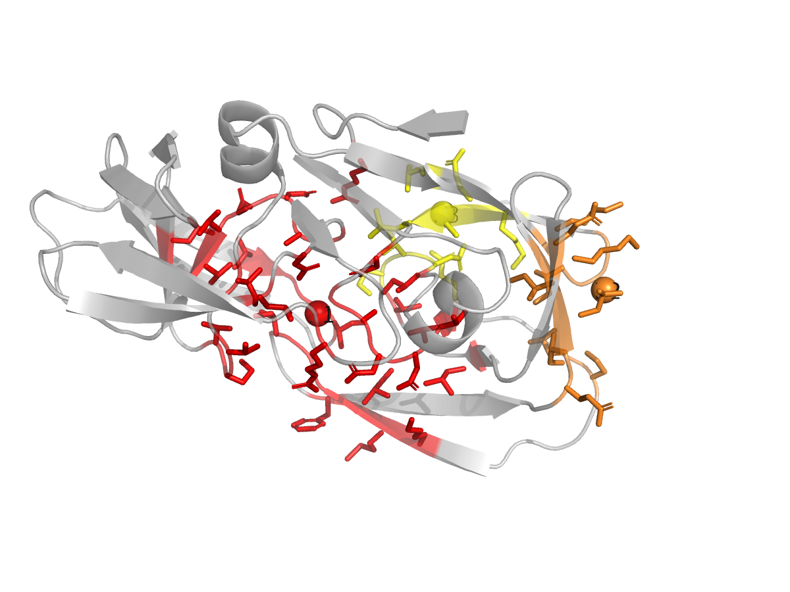

# HIV-1 Protease Pocket Detection (PDB 1HSG)

## Goal

Run pocket detection on the apo-like HIV-1 protease (PDB 1HSG with the MK1 inhibitor stripped) and verify that the top-ranked pocket recovers the known catalytic dyad (Asp25 / Asp25').

## Input

`1HSG_protein.pdb` is the prepared protein-only structure (both chains of the homodimer, no ligand, no waters). It is the same file used in the `drug-binding-site-definition/examples/hiv1-protease/` example.

## Run fpocket

```bash
# Env: drugdisc
python .agents/skills/drug-pocket-detection/scripts/detect_pockets.py \
  --protein .agents/skills/drug-pocket-detection/examples/hiv1-protease/1HSG_protein.pdb \
  --backend fpocket \
  --top_n 5 \
  --output_json .agents/skills/drug-pocket-detection/examples/hiv1-protease/pockets_fpocket.json
```

## Result summary

| Rank | Druggability | Volume (A^3) | Center (x, y, z)   | n_residues |
|---:|---:|---:|---|---:|
| 1 | 0.050 | 1609.2 | ( 13.6,  21.8,   6.4) | 39 |
| 2 | 0.003 |  444.4 | ( 18.3,  17.1, -18.6) | 12 |
| 3 | 0.001 |  306.3 | (  6.6,  24.3,  -7.7) |  9 |
| 4 | 0.001 |  188.7 | ( -2.7,  25.8,  16.5) |  4 |
| 5 | 0.000 |  322.0 | ( 13.1,  37.8,  -6.0) | 11 |

The top pocket is centered on **(13.6, 21.8, 6.4)**, within ~3 A of the co-crystal MK1 ligand center (~14.2, 24.3, 5.9 in
`drug-binding-site-definition/examples/hiv1-protease/binding_site_ligand.json`). Its lining residues include both copies of the catalytic Asp25 plus the flap residues Ile50/Ile50' and the substrate-recognition residues Asp29/Asp30.

> Note on reproducibility: fpocket's alpha-sphere clustering is mildly sensitive to floating-point details across builds and platforms, so volumes / scores may shift by a few percent on a different machine. The top-ranked pocket should still sit on the catalytic dyad. The exact command line and binary path used to produce the shipped JSON are recorded in the file's `backend_command` field.

## The "low druggability score" gotcha

The fpocket logistic-regression model reports a druggability score of only **0.05** for the active site, far below the "druggable" threshold of 0.5. HIV protease is in fact one of the most clinically validated drug targets in history (saquinavir, indinavir, nelfinavir, lopinavir, darunavir, etc.), so the score is wrong here. Why?

- The structure is the **apo-like / open** conformation (we removed MK1). The active site is not a tight pocket but a long open cleft spanning the homodimer interface (volume ~1600 A^3, much larger than typical druggable pockets at 300-800 A^3).
- The fpocket druggability model was trained on holo druggable pockets, which tend to be more enclosed. Open / apo conformations and very large pockets are out of distribution.
- Volume + alpha-sphere count both correctly suggest a major site here, but the logistic-regression model down-weights it.

**Lesson:** druggability scores are useful as a triage signal but should not be the sole criterion for picking a pocket on a protein you know nothing about. Always cross-reference the lining residues against known biology, and prefer to run pocket detection on a **holo** (or holo-like, e.g. an MD-relaxed structure with a placeholder probe) conformation when one is available.

## Visualize

```bash
# Env: drugmd  (PyMOL lives in drugmd)
python .agents/skills/drug-pocket-detection/scripts/visualize_pockets.py \
  --protein .agents/skills/drug-pocket-detection/examples/hiv1-protease/1HSG_protein.pdb \
  --pockets .agents/skills/drug-pocket-detection/examples/hiv1-protease/pockets_fpocket.json \
  --top_n 3 \
  --output .agents/skills/drug-pocket-detection/examples/hiv1-protease/pockets_visualization.png
```

P1 sits squarely between the homodimer flaps; P2 and P3 are peripheral.



## Hand off the chosen pocket to docking

```bash
# Env: drugdisc
python .agents/skills/drug-pocket-detection/scripts/pocket_to_box.py \
  --pockets .agents/skills/drug-pocket-detection/examples/hiv1-protease/pockets_fpocket.json \
  --rank 1 \
  --padding 6.0 \
  --min_size 20.0 \
  --output_json .agents/skills/drug-pocket-detection/examples/hiv1-protease/binding_site_from_pocket.json
```

The resulting `binding_site_from_pocket.json` is consumable directly by [drug-docking-vina](../../../drug-docking-vina/SKILL.md). It uses the `bounding_box` sizing strategy, so the resulting box is anisotropic (~29 x 27 x 24 A) and matches the actual elongated shape of the HIV protease active site rather than wasting volume on a forced cube. Its center (~12.6, 21.2, 7.6) sits within ~3 A of the box derived from the MK1 co-crystal ligand (14.2, 24.3, 5.9), so this pocket-only path would dock to the right site even with no prior knowledge of the active site.

## Optional: P2Rank as a second opinion

If the `prank` CLI is on PATH, run the ML backend for an independent ranking:

```bash
# Env: drugdisc
python .agents/skills/drug-pocket-detection/scripts/detect_pockets.py \
  --protein .agents/skills/drug-pocket-detection/examples/hiv1-protease/1HSG_protein.pdb \
  --backend p2rank \
  --top_n 5 \
  --output_json pockets_p2rank.json
```

P2Rank typically picks the active-site pocket as rank 1 with a higher probability than fpocket's logistic-regression score does on this structure, illustrating the fpocket weakness on apo conformations described above.
