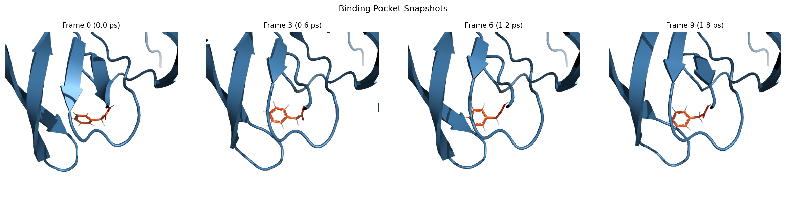
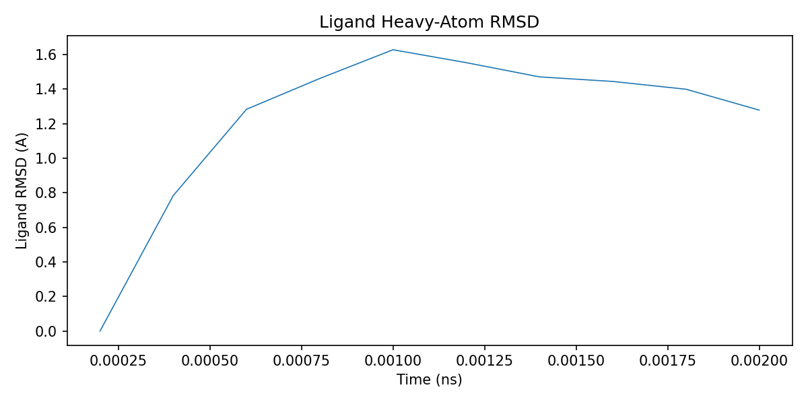
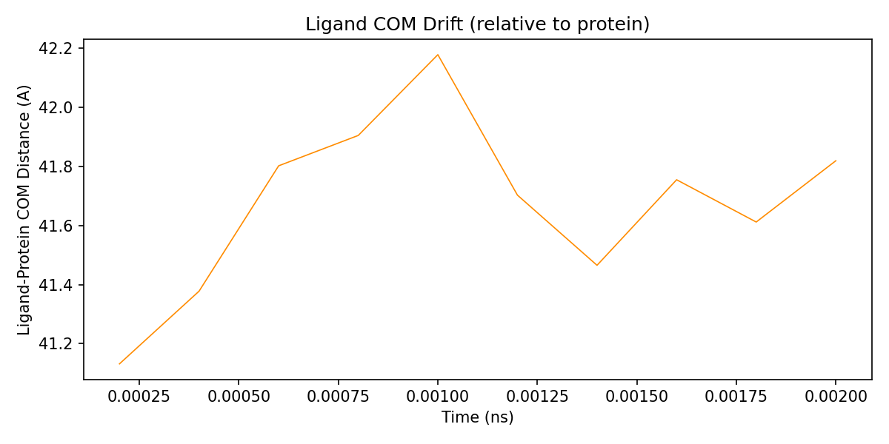
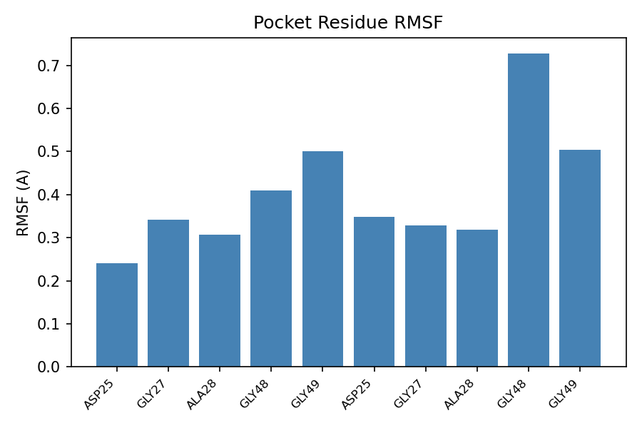
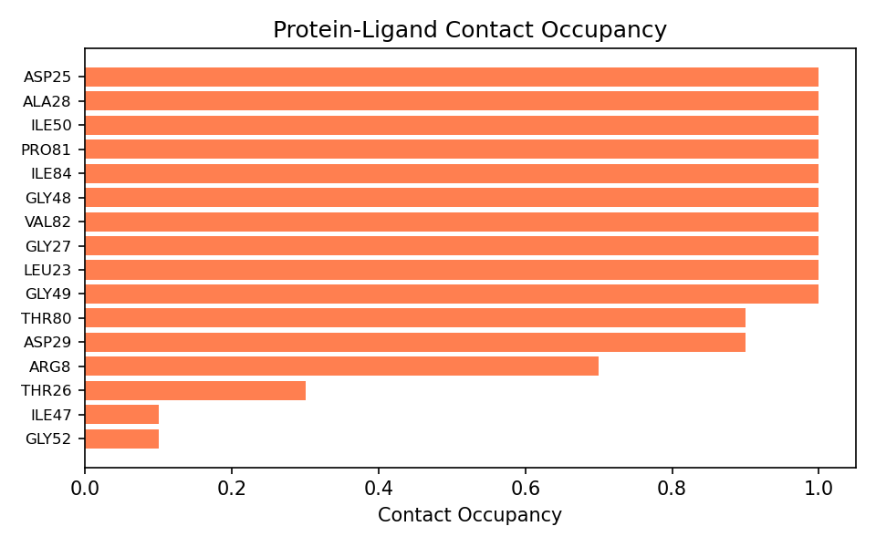

# HIV-1 Protease Trajectory Analysis Example (PDB 1HSG)

## Goal
Demonstrate full trajectory analysis (RMSD, COM, RMSF, H-bonds, contacts, IFPs) on the short MD trajectory from the protein-ligand MD example.

## Input Files
Uses outputs from the system builder and MD examples:
- Topology: `drug-complex-system-builder/examples/hiv1-protease/system/complex_solvated.pdb`
- Trajectory: `drug-protein-ligand-md/examples/hiv1-protease/run/production.dcd`

## Steps

```bash
# Env: drugmd-agent
python .agents/skills/drug-trajectory-analysis/scripts/analyze_trajectory.py \
  --topology <path_to>/system/complex_solvated.pdb \
  --trajectory <path_to>/run/production.dcd \
  --ligand_resname UNK \
  --pocket_cutoff 5.0 \
  --output_dir analysis/
```

Note: the ligand residue name is `UNK` (assigned by OpenMM for non-standard residues). Check the solvated PDB to determine the correct residue name for your system.

## Expected Output
- `analysis/ligand_rmsd.csv`: per-frame RMSD (mean ~1.2 A)
- `analysis/ligand_com.csv`: ligand COM relative to protein backbone COM (drift ~1.2 A)
- `analysis/pocket_rmsf.csv`: 10 pocket residues (ASP25, GLY27, ALA28, GLY48, GLY49 from both chains)
- `analysis/hbonds.csv`: ~70 inter-molecular H-bond pairs with >5% occupancy
- `analysis/contacts.csv`: 16 residues in contact, ASP25/LEU23/ALA28/ILE84/GLY27 at 100% occupancy
- `analysis/interaction_fingerprints.csv`: per-frame IFPs via ProLIF
- `analysis/analysis_summary.json`: all summary statistics

## Plots

### Binding Pocket Snapshots
PyMOL-rendered views of the ligand (orange sticks) in the protein binding pocket (blue cartoon) at 4 timepoints across the trajectory.



### Ligand RMSD


### Ligand COM Drift


### Pocket Residue RMSF


### Protein-Ligand Contact Occupancy


## Notes
- This uses a 2 ps test trajectory (10 frames) for pipeline validation only.
- In a real workflow, ligand RMSD < 2-3 A and stable contacts indicate a reliable pose.
- The `--rmsd_only` flag is available for quick screening before running full analysis.
