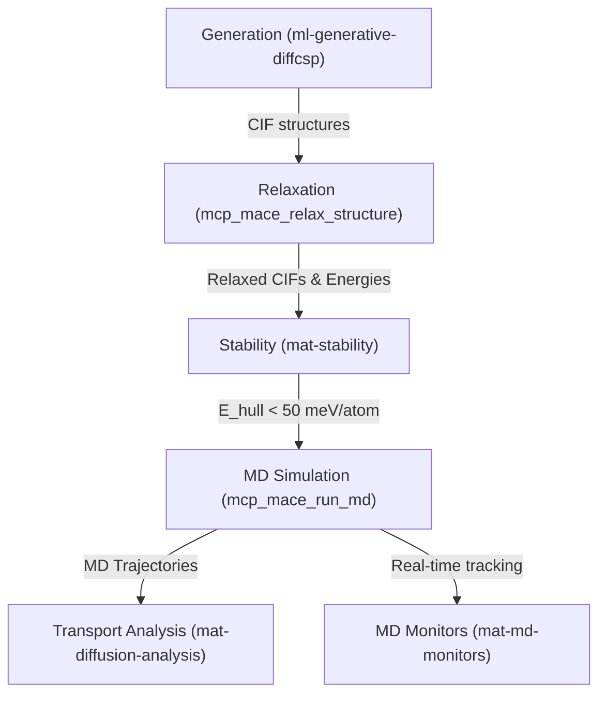

# Example: Solid-State Electrolyte Discovery Workflow

This example demonstrates how the `general-workflow-planner` decomposes a high-level scientific objective from literature into a concrete **Detailed Action Plan** to be used in a `research_plan.md`.

## 1. Objective Parsing
**Target Goal:** Discover and evaluate a novel chloride-based solid-state electrolyte (SSE) for Li-ion batteries with high ionic conductivity and thermodynamic stability.

**Conceptual Steps:**
1. Generate speculative Li-M-Cl crystal structures.
2. Relax geometries and rank based on thermodynamic stability (Energy above the convex hull, $E_{hull}$).
3. Evaluate ionic transport kinetics (Diffusivity / Conductivity).

## 2. Skill Registry Mapping
Mapping capabilities from `.agents/skills/` and MCP tools:
- **Generation:** `ml-generative-diffcsp` 
- **Relaxation & Energy Evaluation:** `mcp_mace_relax_structure` 
- **Thermodynamic Stability:** `mat-stability` skill
- **Dynamics:** `mcp_mace_run_md` (MCP tool), `mat-md-monitors`, `mat-diffusion-analysis`

## 3. Dependency & Feasibility Analysis
- **Data Flow:** The `.cif` output from generative design feeds correctly into the `mace` relaxation tool. The relaxed structures map cleanly into the `mat-stability` script for $E_{hull}$. Stable candidates can be passed directly as pathways to the MCP MD tool (`mcp_mace_run_md`).
- **Gaps:** None identified. 

## 4. Detailed Action Plan
*Below is the formatted chronological list of steps that the planner would append to the **Detailed Action Plan** in `research_plan.md`.*

### Execution Steps
1. **Structure Generation**: 
   - Use the **`ml-generative-diffcsp`** skill targeting high-conductivity Li-M-Cl space groups. 
2. **Structure Relaxation**: 
   - Execute the **`mcp_mace_relax_structure`** tool (`model_name="MACE-MP-0-medium"`, `fmax=0.05`). 
3. **Stability Screening**: 
   - Pass the relaxed energies to the **`mat-stability`** script to compute $E_{hull}$. Filter out all candidates where $E_{hull} > 50$ meV/atom.
4. **Molecular Dynamics**: 
   - For surviving structures, run an NVT simulation employing the **`mcp_mace_run_md`** tool. 
   - *Hyperparameters*: Set `temperature=800`, `steps=50000`, `timestep=2.0`, `ensemble="nvt"`.
5. **Real-Time Monitoring**: 
   - Concurrently use the **`mat-md-monitors`** skill to track structural stability/melting during the MD run. 
6. **Transport Analysis**: 
   - Supply the resulting `.traj` files to **`mat-diffusion-analysis`** to extract Einstein diffusivities and calculate macroscopic ionic conductivity.
