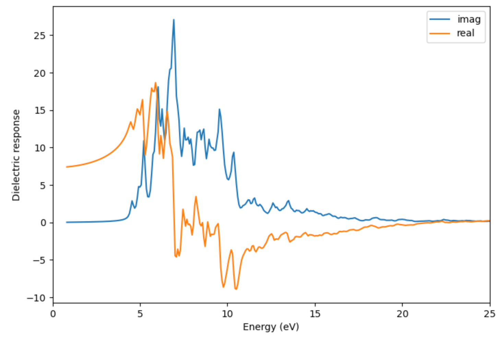

# Silicon Carbide Optical Dielectric Response Example

This example demonstrates calculating the frequency-dependent dielectric response of crystalline silicon carbide.

## Input Structure

- **Material**: Silicon carbide (SiC)
- **Space Group**: F-43m (#216), zinc blende

## Calculation Details

- **Preset**: OMAT (PBE functional)
- **Workflow**: Two-step optics workflow
- **Representative Settings**: `NBANDS = 64`, `NEDOS = 2000`, `CSHIFT = 0.1`

## Results



The plot shows the real and imaginary parts of the frequency-dependent dielectric response of SiC.

> **Note**: Semi-local DFT typically underestimates the optical absorption onset because the band gap is underestimated. For more accurate spectra, hybrid functionals or beyond-DFT methods may be needed.

## Post-Processing

The dielectric-response plot was generated using:

```bash
# Env: base
python .agent/skills/mat-dielectric-response/scripts/plot_dielectric.py \
    SiC_optics \
    --output SiC_dielectric_response.png \
    --mode average \
    --xmax 20
```

For anisotropic materials, the diagonal tensor components can be plotted separately using:

```bash
# Env: base
python .agent/skills/mat-dielectric-response/scripts/plot_dielectric.py \
    SiC_optics \
    --output SiC_dielectric_components.png \
    --mode diagonal \
    --xmax 20
```

If you want to inspect the raw dielectric data in `OUTCAR`, search for:

- `frequency dependent IMAGINARY DIELECTRIC FUNCTION`
- `frequency dependent REAL DIELECTRIC FUNCTION`
- `MACROSCOPIC STATIC DIELECTRIC TENSOR`
