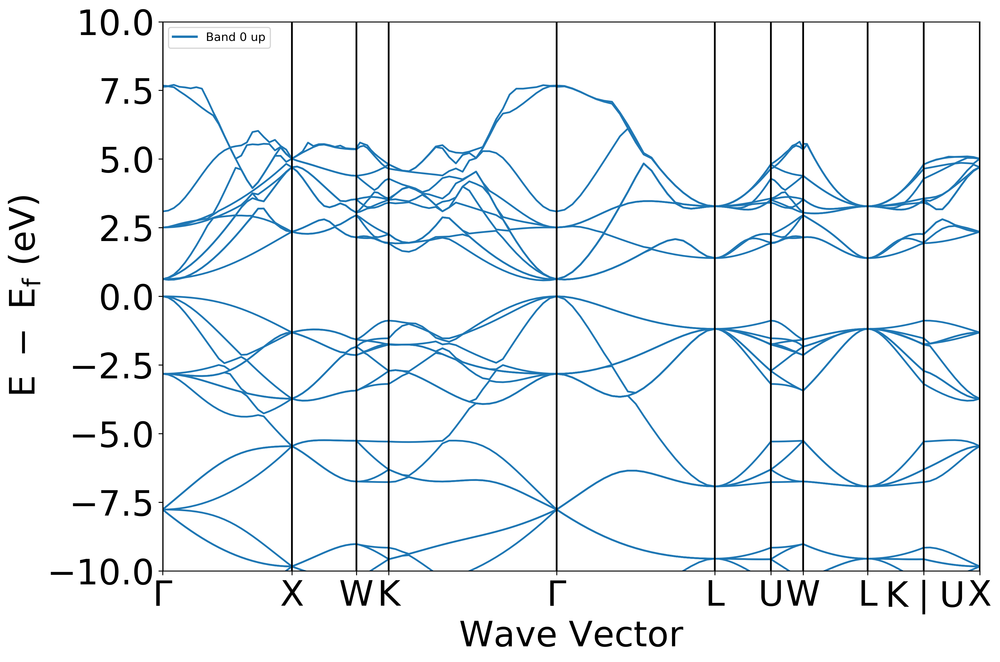
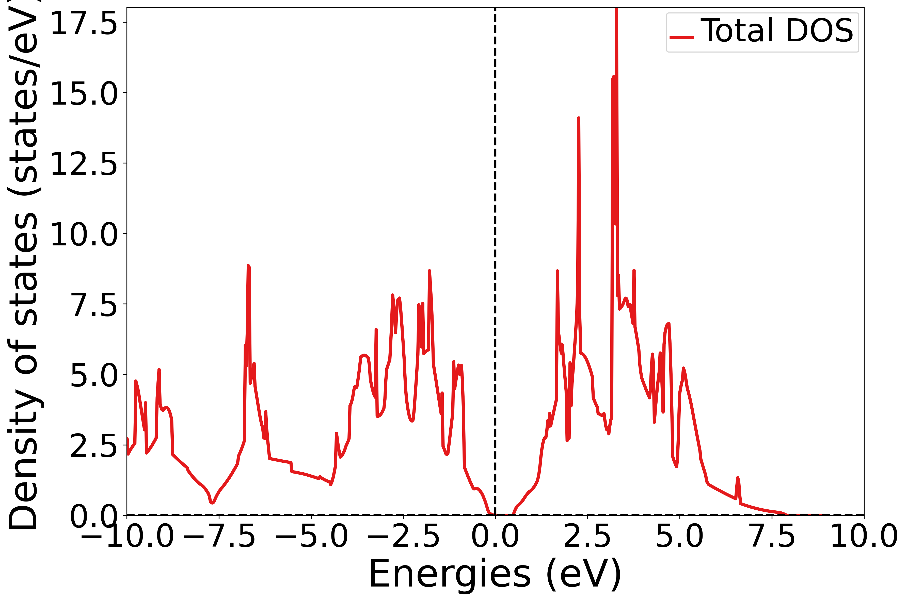

# Silicon Band Structure Example

This example demonstrates calculating the electronic band structure of crystalline silicon.

## Input Structure

- **Material**: Silicon (Si)
- **Space Group**: Fd-3m (#227), diamond cubic
- **Lattice Parameter**: a = 5.468 Å

## Calculation Details

- **Preset**: OMAT (PBE functional)
- **Band Structure Mode**: Line (high-symmetry k-path)
- **Workflow**: Two-step (Static SCF → Non-SCF band structure)

## Results



**Band Gap**: 0.581 eV (indirect, Γ → (0.030,0.030,0.060))

> **Note**: The PBE functional underestimates the experimental band gap of silicon (~1.17 eV). For more accurate band gaps, hybrid functionals (HSE06) or GW methods are recommended.

## Post-Processing

The band structure plot was generated using:

```bash
# Env: base
python .agents/skills/mat-electronic-structure/scripts/plot_band_structure.py band_structure_calc --output Si_band_structure.png
```

---

# Silicon Density of States (DOS) Example

This example demonstrates calculating the electronic density of states (DOS) for silicon using a uniform k-mesh.

## Input Structure

Same as the band structure example (silicon, Fd-3m).

## Calculation Details

- **Preset**: OMAT (PBE functional)
- **Band Structure Mode**: Uniform (dense k-mesh for DOS)
- **Workflow**: Two-step (Static SCF → Non-SCF uniform)

## Results



**Band Gap**: 0.496 eV
**Fermi Level**: 5.604 eV

The DOS plot shows the distribution of electronic states as a function of energy. The gap between the valence and conduction bands is clearly visible.

## Post-Processing

The DOS plot was generated using:

```bash
# Env: base
python .agents/skills/mat-electronic-structure/scripts/plot_dos.py dos_calc --output Si_dos.png
```
