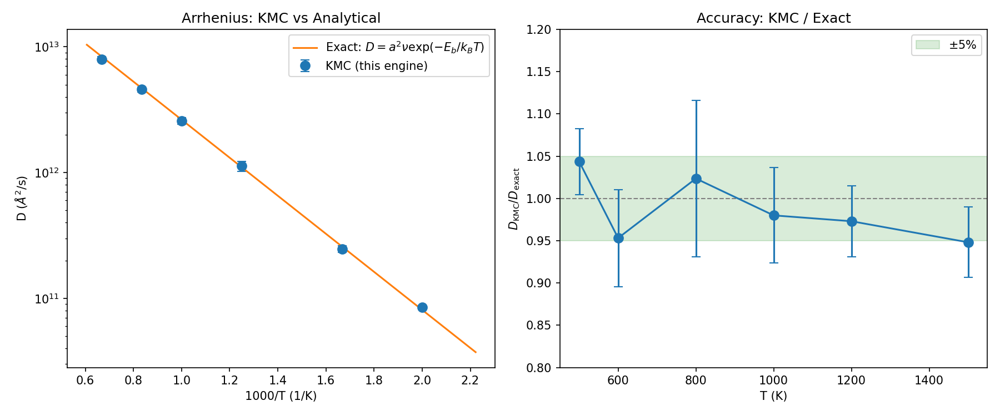

## Analytical Validation: Random Walk on Simple Cubic Lattice

Validates the lattice KMC engine against the exact diffusivity for non-interacting carriers:

D = a^2 * nu * exp(-E_b / k_BT) * (1 - c)

where `c` is the carrier concentration (blocking correction for finite occupancy).

### Setup

- **Lattice**: 10x10x10 simple cubic, a = 3.0 A (1000 sites)
- **Carriers**: 50 (5% occupancy)
- **Rate model**: constant barrier, E_b = 0.3 eV, nu = 10^13 Hz
- **Steps**: 500,000 per replica, 10 replicas per temperature
- **Temperatures**: 500, 600, 800, 1000, 1200, 1500 K

### Running

```bash
# Env: base
python validate_random_walk.py --max_steps 500000 --n_replicas 10 \
    --out_dir .
```

### Results

| T (K) | D_kmc / D_exact | Error |
|--------|----------------|-------|
| 500    | 1.044          | +4.4% |
| 600    | 0.953          | -4.7% |
| 800    | 1.024          | +2.4% |
| 1000   | 0.980          | -2.0% |
| 1200   | 0.973          | -2.7% |
| 1500   | 0.948          | -5.2% |

All temperatures within 5.2% of the blocking-corrected analytical result.



### Findings

1. **Single-point D = MSD/(6t)** is the correct analysis for KMC (matching kMCpy convention). Linear fitting of MSD(t) fails due to high variance of cumulative displacements.
2. **Blocking correction (1-c)** is necessary when comparing against the non-interacting exact result.
3. **Statistical convergence** requires ~500 independent displacement samples (carriers x replicas) to get errors below 5%.

### Files

- `validate_random_walk.py`: Self-contained validation script
- `validation_summary.json`: Numerical results
- `validation_plot.png`: Arrhenius and accuracy plots
- `runs/` (generated, gitignored): Per-temperature/replica KMC traces
