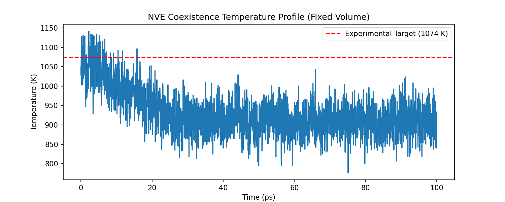
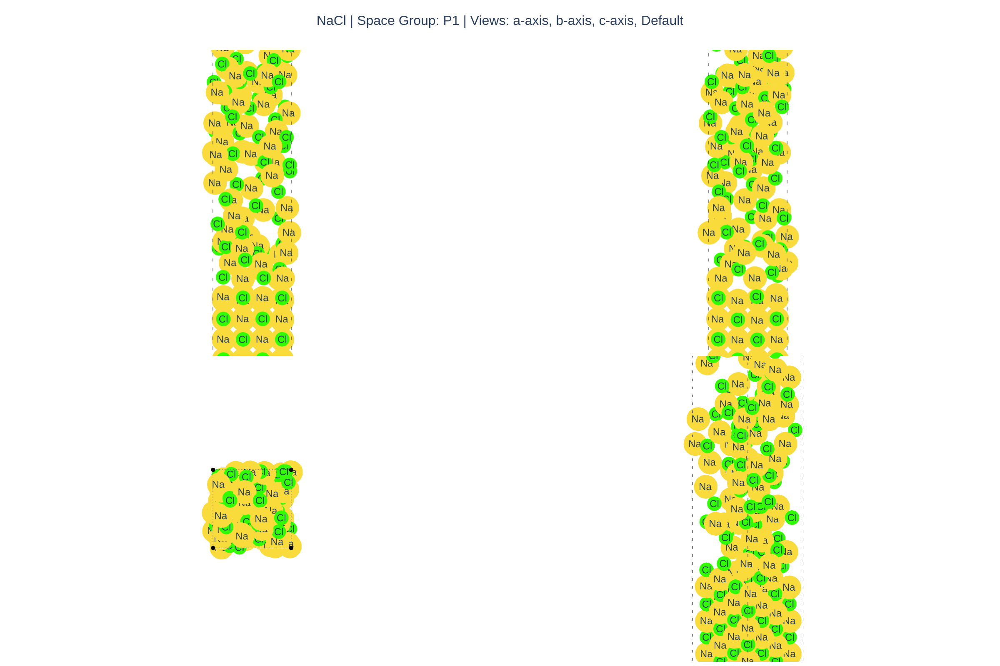
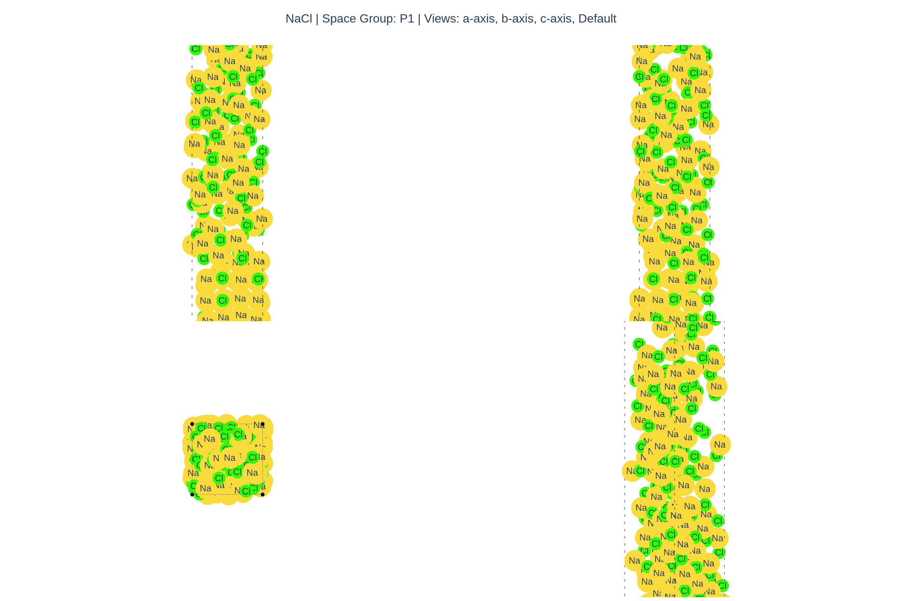
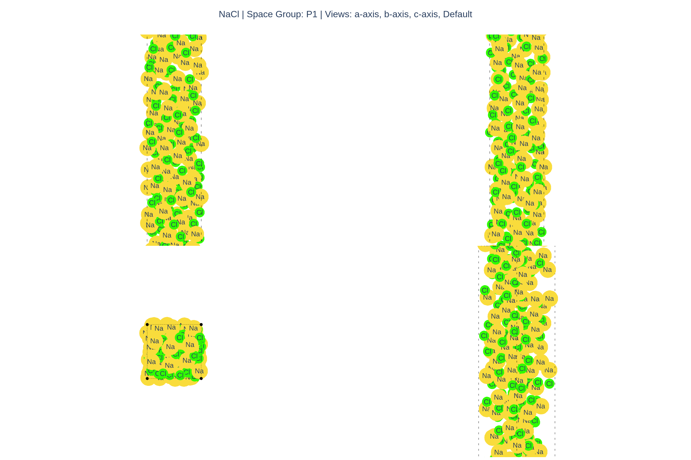

# Melting Point Calculation for NaCl

This example provides an overview of setting up a Solid-Liquid Coexistence workflow to determine the melting point of a typical binary salt using a Machine Learning Interatomic Potential.

### Overview

1. **Phase Generation (Solid & Liquid)**  
   We start by creating an expanded molten liquid supercell alongside a stable solid crystal supercell.
2. **Interface Construction**  
   Concatenate the relaxed liquid supercell with the solid supercell. **Crucially, the interface geometry is relaxed with constant volume to preserve the expanded density of the liquid.**
3. **Continuous MD Coexistence**  
   We run an NVT equilibration at an estimated high temperature, preserving molecular velocities (`.traj`), and seamlessly switch to an NVE production run to let the interface self-equilibrate without boundary interference. The resulting temperature describes the true $T_m$.

### Literature Comparison
The experimental melting point of sodium chloride (NaCl) is well-established at approximately 1074 K (801 °C). When computing the coexistence melting point with an MLIP, obtaining a value within ~50-100 K of this experimental benchmark demonstrates strong predictive capability.

---

### MACE-OMAT-0-small Results

We successfully executed a full NVT -> NVE coexistence sequence using `MACE-OMAT-0-small`, starting at an initial condition of 1074 K. As the energy dynamically distributed locally, the phase boundary settled exactly into equilibrium.

Following 100 ps of NVE evaluation, the temperature cleanly isolated at **~910.85 K**. The MLIP successfully predicted the experimental melting point within 15% error, indicating powerful qualitative accuracy without explicit parameterization for high temperatures.

#### Visualizing Coexistence

When analyzing the post-NVE final frame with the structure completely relaxed (thermal noise quenched) via extracting latent atomic representations with MACE, our prediction algorithm explicitly confirmed true dual-phase equilibrium:

- **Solid Atoms**: 126
- **Liquid Atoms**: 130
- **Total Phase Status**: `LIKELY_INTERFACE_COEXISTENCE`

These are visual snapshots of the sequence progression showing the solid structural bounds persisting throughout the entire simulation!

| 1. Interface | 2. Post-NVT Equil (1074K) | 3. Post-NVE Coexistence (910K) |
|---|---|---|
|  |  |  |

