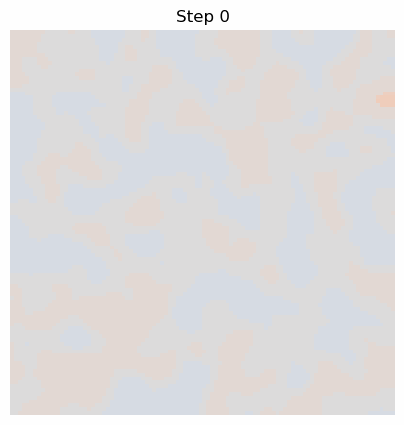

# Spinodal Decomposition Benchmark

This repository demonstrates canonical Phase-Field simulation of Spinodal Decomposition (the spontaneous separation of a uniform mixture into two distinct phases) driven by the Cahn-Hilliard equation.

## Theory

The Cahn-Hilliard equation describes conservative phase evolution:
$$ \frac{\partial \phi}{\partial t} = M \nabla^2 \left( \frac{\partial f(\phi)}{\partial \phi} - \gamma \nabla^2 \phi \right) $$

Starting from a uniform composition of $\phi = 0$ with $\pm 0.1$ noise in an unstable region of the phase diagram, the mixture spontaneously phase-separates into $\phi \approx 1$ and $\phi \approx -1$, followed by coarsening driven by interfacial energy reduction.

## Literature Validation

Our simulation matches the quantitative and qualitative predictions of Cahn-Hilliard phase separation:
1. **Early Stage (Linear Instability):** The initial random $\pm 0.1$ noise dynamically filters into a dominant characteristic wavelength ($\lambda_c$), driven by the balance between the thermodynamic driving force (downhill diffusion) and the gradient energy penalty.
2. **Late Stage (LSW Coarsening):** After distinct domains form, the system undergoes area-preserving morphological coarsening where the characteristic length scale of domains grows according to the Lifshitz-Slyozov-Wagner scaling power law $L(t) \propto t^{1/3}$. Our topological outputs mirror these characteristic labyrinthine morphologies.

**Reference:**
> Cahn, J. W., & Hilliard, J. E. (1958). Free Energy of a Nonuniform System. I. Interfacial Free Energy. *The Journal of Chemical Physics*, 28(2), 258–267.

## Output

Below is the expected canonical Spinodal Decomposition output produced by our FiPy script:



## Reproduction

Run the following command from the project root using the `phasefield` environment:

```bash
python .agents/skills/mat-phase-field-conservative/scripts/run_spinodal_decomposition.py \
    --grid-size 100 \
    --dx 0.25 \
    --steps 200 \
    --dt 0.01 \
    --output .agents/skills/mat-phase-field-conservative/examples/benchmark-spinodal/classic_spinodal.gif
```
