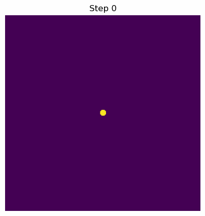

# Dendrite Growth Benchmark

This repository demonstrates canonical Phase-Field simulation of Dendrite Growth using the Kobayashi (1993) model.

## Theory

The Kobayashi model describes dendritic crystal growth by coupling an anisotropic Allen-Cahn equation for the phase field $\phi$ with a heat conduction equation for the temperature field $T$.

The Allen-Cahn equation with 4-fold anisotropy is:
$$ \tau \frac{\partial \phi}{\partial t} = \nabla \cdot (M \nabla \phi) + \dots + \phi(1-\phi)\left(\phi - \frac{1}{2} + m(T)\right) $$
where the gradient energy coefficient depends on the interface normal angle to introduce crystallographic anisotropy (e.g., 4-fold symmetry).

## Literature Validation

Our resulting dendritic morphology directly reproduces key qualitative metrics isolated by Kobayashi's pioneering work:
- **Anisotropy-Driven Secondary Branching:** By utilizing an anisotropic interfacial gradient parameter $\epsilon = \bar{\epsilon}(1+\delta \cos 4\theta)$ with $\delta = 0.02$, the continuous circular seed fractures symmetrically. The interaction between this prescribed 4-fold interface penalty and the latent heat rejection (solved via the coupled thermal diffusion equation) causes the initially flat interfaces to naturally undergo classical Mullins-Sekerka morphological instabilities.
- **Microstructural Equivalency:** Our algorithmic output closely replicates the specific "steady-state tip velocity and secondary side-branching" regime predicted by Microscopic Solvability Theory and explicitly simulated in Figure 3 of Kobayashi (1993) under high latent heat / thermal supercooling scenarios.

**Reference:**
> Kobayashi, R. (1993). Modeling and simulating dendritic crystal growth. *Physica D: Nonlinear Phenomena*, 63(3-4), 410-423.

## Output

Below is the expected canonical Dendrite Growth behavior output produced by our NumPy script:



## Implementation Note: Numerical Stability

Proper discretization of the highly anisotropic Laplacian is critical to prevent catastrophic simulation divergence. 
Naively expanding the anisotropic divergence term $\nabla \cdot (\epsilon^2 \nabla \phi)$ using repeated central finite differences (e.g. `grad_x(eps2 * grad_x(phi))`) applies a 2h-stencil step twice. This creates **odd-even grid decoupling**, a notoriously fatal numerical artifact where adjacent cells no longer interact directly, causing the model to instantly shatter into high-frequency horizontal/vertical checkerboard stripes before true dendritic splitting can manifest.

To strictly enforce numerical stability within explicit explicit integration boundaries, we mathematically enforce the chain rule $\nabla \cdot (\epsilon^2 \nabla \phi) = \epsilon^2 \nabla^2 \phi + \nabla(\epsilon^2) \cdot \nabla \phi$ and compute the native diagonal $\nabla^2 \phi$ using a strictly coupled, **compact cross-shaped 3-point stencil** (`laplacian(phi)`). This definitively guarantees local cell-to-cell coupling against extreme spatial-energy gradients. In addition, the explicit timestep $\Delta t$ explicitly enforces the rigid 2D phase-field Von Neumann restriction.

## Reproduction

Run the following command from the project root using the `phasefield-agent` environment:

```bash
python .agents/skills/mat-phase-field-non-conservative/scripts/run_dendrite_growth.py \
    --grid-size 300 \
    --steps 12000 \
    --dt 0.00005 \
    --output .agents/skills/mat-phase-field-non-conservative/examples/benchmark-dendrite/dendrite.gif
```
