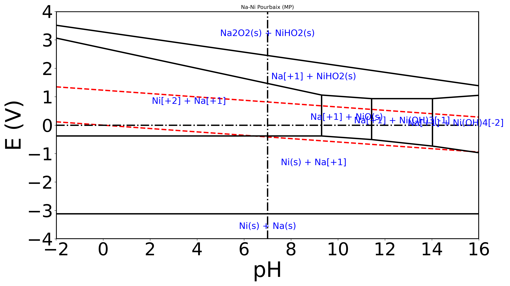
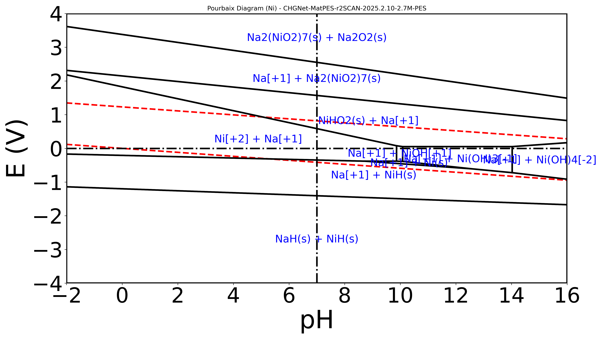

# Na-Ni (2:1) Pourbaix Diagram Example

This example demonstrates the calculation of a multi-element Pourbaix diagram for the Sodium-Nickel system (Na:Ni = 2:1). It highlights the importance of using **r2SCAN-trained MLIPs** (like MatPES) to ensure energy scale compatibility with Materials Project aqueous ions.

## 1. Pure Materials Project (Baseline)

Generated using only Materials Project data (DFT r2SCAN/PBE mix + corrections). This serves as the "ground truth" for stable phases in standard conditions.



**Command:**
```bash
python .agents/skills/mat-pourbaix-diagram/scripts/calculate_pourbaix_mp.py \
    --comp_dict "Na=2,Ni=1" \
    --output ./output_mp \
    --title "Na-Ni Pourbaix (MP)"
```

**Key Features:**
- Shows `NiHO2` (NiOOH) and `Na2O2` at high potentials.
- Aqueous ions `Ni[+2]` and `Na[+1]` have large stability domains.

---

## 2. CHGNet MatPES-r2SCAN (Recommended MLIP)

Generated using `CHGNet-MatPES-r2SCAN-2025.2.10-2.7M-PES`. This model is trained on r2SCAN data, making its solid formation energies (e.g., `NiO` ~ -1.97 eV/atom) compatible with MP aqueous ions (which are often -0.7 to -3.0 eV).



**Command:**
```bash
python .agents/skills/mat-pourbaix-diagram/scripts/calculate_pourbaix.py \
    --relaxed_solids ./relaxed_solids \
    --comp_dict "Na=2,Ni=1" \
    --mlip_name "CHGNet-MatPES-r2SCAN-2025.2.10-2.7M-PES" \
    --output ./output_mlip \
    --target Ni
```

**Why it works:**
- Older/Standard MLIPs (like `CHGNet-PBE` or `M3GNet-MP`) often over-stabilize solids (e.g., predicting `NiO` at -4.3 eV/atom), which completely suppresses the aqueous ion domains in the diagram.
- **MatPES-r2SCAN** models align much better with the MP/experimental energy scale, allowing ions and solids to compete correctly.

## Parameters Used
- **Composition**: Na:Ni = 2:1
- **Concentration**: $10^{-6}$ M
- **Voltage Range**: -4 V to +4 V
- **pH Range**: -2 to 16
