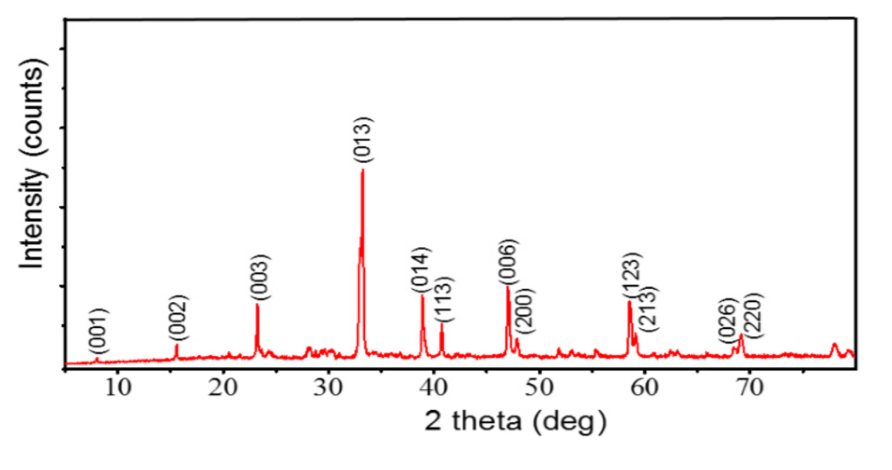
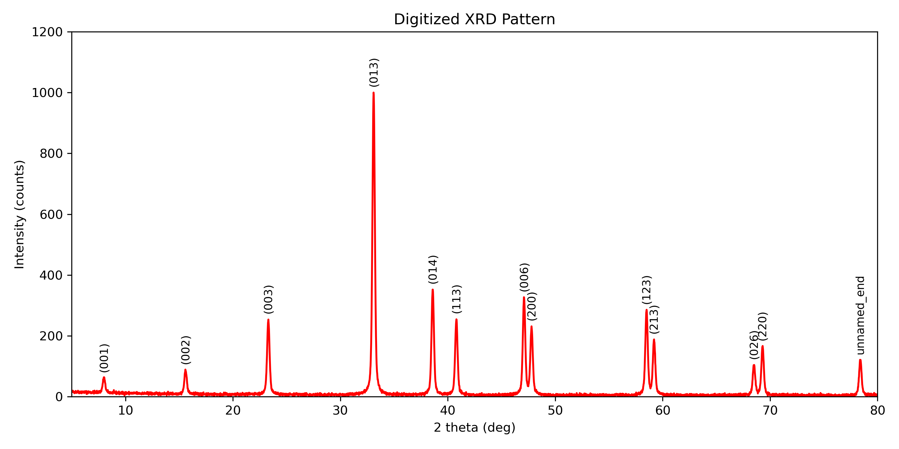

# Digitize YBCO Example

## Goal

To demonstrate how the `mat-xrd-digitizer` skill translates manually extracted visual peaks into a numeric `.xy` X-Ray Diffraction data file. This specific example simulates extracting peaks from a standard YBa₂Cu₃O₇-δ (YBCO) powder diffraction scan.

## Instructions


*Original image source: "Preparation of YBCO Superconductor and Analysis of Factors Affecting the Material's Properties", Energy Procedia, 2016. [Link to paper](https://www.sciencedirect.com/science/article/pii/S1877705816310645?via%3Dihub)*

1. **Review the JSON input**: The file `peaks.json` clearly outlines the extracted 2-theta positions, generic normalized intensities, and approximate line widths (FWHM) derived visually.

2. **Generate `.xy` plot**: Run the `digitize_plot.py` script.

```bash
# Env: base
python ../../scripts/digitize_plot.py peaks.json --output example_ybco.xy --min-x 5.0 --max-x 80.0
```

## Expected Outcome

The script will smoothly synthesize a numerical array mapping to mathematical Pseudo-Voigt continuous peak models representing the visual points, and write them sequentially into `example_ybco.xy`. This resulting file is fully ready for input to computational indexing and standard phase-matching scripts, such as `mat-xrd-phase-analysis`.

**It will also automatically generate a plot of the digitized data** so you can visually verify the extraction against the original image:


