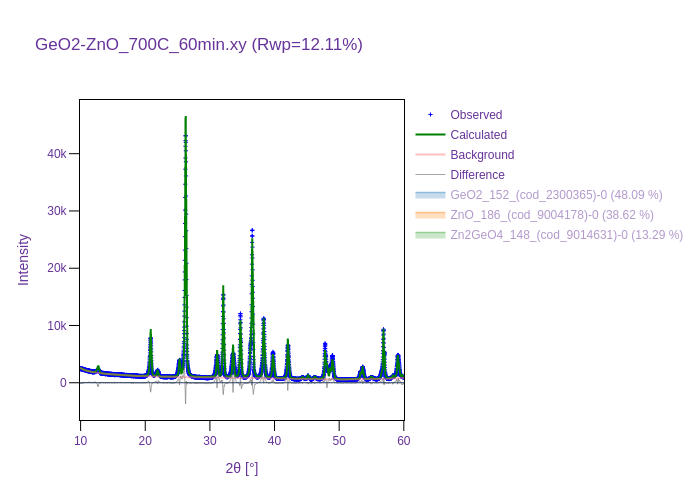

# Phase Analysis of GeO2-ZnO System

This example demonstrates how to use the DARA automated phase analysis tool on an experimental XRD pattern of a GeO2-ZnO sample sintered at 700°C for 60 minutes.

### Files Provided:
- `GeO2-ZnO_700C_60min.xrdml`: The raw XRD data from the experiment.
- `phase_analysis_results/`: The output folder containing the phase identification results.
- `phase_analysis_results/solution_0_refinement.png`: A visual inspection of the fit against the experimental pattern.
- `phase_analysis_results/cifs/`: The matched structure files.

### Workflow

We identify the constituent phases using DARA's tree-search algorithm. Run the phase analysis tool against the raw `.xrdml` data. It identifies the crystalline signature of both GeO2 and ZnO, and potentially other emergent compounds.

```bash
python ../../scripts/run_phase_analysis.py --data GeO2-ZnO_700C_60min.xrdml --output_dir phase_analysis_results
```

The results are summarized in `results_summary.json` mapping the probability of matches for each reference CIF found.

### Literature Comparison
In standard literature detailing the `ZnO-GeO2` pseudobinary system, solid-state reactions (calcination or sintering) between ZnO and GeO2 at temperatures ranging from 700 °C to 1000 °C predominantly yield the inverse spinel phase **zinc orthogermanate (Zn2GeO4)** ($2\text{ZnO} + \text{GeO}_2 \rightarrow \text{Zn}_2\text{GeO}_4$).
The DARA automated search on our experimental dataset independently confirms this empirical consensus. Looking at `results_summary.json`, the solver successfully extracted the `Zn2GeO4_148` (space group R-3) reference profile as a primary constituent phase with high confidence alongside residual unreacted starting materials (`GeO2` and `ZnO`), matching textbook reaction expectations.

### Visual Validation

