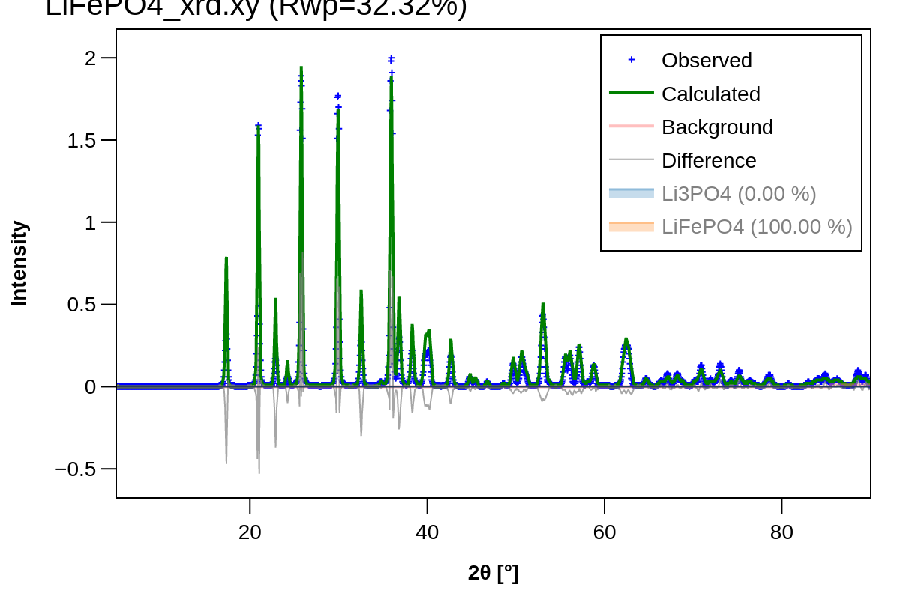

# Rietveld Refinement of LiFePO4

This example demonstrates how to run a full Rietveld refinement using DARA (BGMN) on an experimental X-ray diffraction pattern of a LiFePO4 battery cathode material.

### Files Provided:
- `LiFePO4_xrd.xy`: The raw XRD data (angle and intensity) extracted from the experiment.
- `cifs/`: Reference structural layouts (e.g. `LiFePO4.cif` and `Li3PO4.cif`) to be refined against the pattern.
- `refinement_results/`: The output directory containing refined lattice parameters, goodness of fit metrics, and visual plots.

### Workflow

Run the refinement script passing the experimental curve and the initial structural models:

```bash
python ../../scripts/run_refinement.py \
    --data LiFePO4_xrd.xy \
    --cif_dir cifs \
    --output_dir refinement_results
```

The resulting `LiFePO4_refinement.png` plots the raw data against the computed Rietveld fit, mapping the residuals at the bottom of the graph.

### Visual Validation

