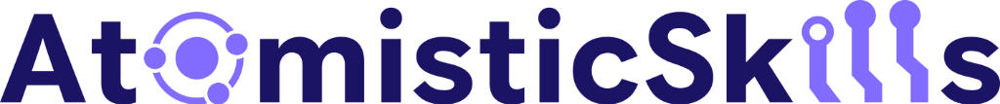

# AtomisticSkills



## Overview
**AtomisticSkills** is a composable framework for AI-driven atomistic materials research. Built on the **hierarchical decomposition** of complex scientific tasks into **Workflows** → **Skills** → **Tools**, it enables coding AI agents to autonomously conduct multi-stage materials, chemistry, and drug discovery research by combining modular, reusable capabilities.

The framework integrates state-of-the-art Machine Learning Interatomic Potentials (MLIPs), DFT calculations, generative AI, database APIs, and advanced simulation methods through the Model Context Protocol (MCP) tools and Skills, making advanced materials research accessible to AI copilots like Google Antigravity, Cursor, and Claude Code.


---

## Hierarchical Research Framework

**AtomisticSkills** constructs complex scientific tasks from three abstraction levels: **Tools** → **Skills** → **Workflows**. This hierarchy enables AI agents to tackle materials research problems by composing modular capabilities.

---

### 📎 Tools (Low-Level Research Primitives)
[**View MCP Tools**](src/mcp_server)

Tools are **strictly structured, fundamental operations** exposed as Python functions through MCP servers. They have **fixed input/output types** and must match function call signatures exactly—similar to standard library APIs.

**Key Characteristics:**
- **Strict Type Checking**: Input and output types must match Python function signatures precisely
- **Battle-Tested**: Optimized, reliable implementations for core operations
- **Direct Callable**: The agent invokes tools directly via MCP protocol

**Tool Categories:**

1. **MCP Tools** (General-purpose primitives):
   - Structure relaxation (geometry optimization)
   - Molecular dynamics (NVT, NPT, NVE ensembles)
   - Monte Carlo simulation (cluster expansion)
   - MLIP simulation
   - DFT input preparation and output parsing

2. **Skill-Specific Scripts** (Specialized helpers):
   - Phase identification for melting point calculations
   - Parity plot generation for MLIP benchmarking
   - Diffusion coefficient fitting from MSD data

---

### ⚙️ Skills (Mid-Level Research Tutorials)
[**Browse Skills →**](.agents/skills)

Skills are **flexible tutorials** that combine multiple tool calls to solve focused research problems. Unlike tools, skills have **no fixed input/output type constraints**—the agent handles all data conversion and orchestration between steps.

**Key Characteristics:**
- **Flexible Composition**: Tutorials showing "how to combine tools" for specific tasks
- **Agent-Managed**: The agent handles data format conversions between tool calls
- **Self-Documented**: Each skill includes instructions (`SKILL.md`), helper scripts, and examples

**Examples:**
- [**MLIP Training**](.agents/skills/ml-mlip-training/SKILL.md): Benchmark and fine-tune MLIPs using data augmentation
- [**Diffusion Analysis**](.agents/skills/mat-diffusion-analysis/SKILL.md): Compute diffusion coefficients and activation energies
- [**Material Stability**](.agents/skills/mat-stability/SKILL.md): Calculate 0K thermodynamic stability and $E_{hull}$
- [**Molecular Docking**](.agents/skills/drug-docking-vina/SKILL.md): Dock small-molecule ligands into a protein receptor using AutoDock Vina
- [**Gas Sorption**](.agents/skills/chem-sorption-gcmc/SKILL.md): Calculate gas adsorption isotherms via Grand Canonical Monte Carlo (GCMC) simulations


---

### 🎯 Workflows (High-Level Research Objectives)
[**Browse Workflows →**](.agents/workflows)

Workflows represent **complete, high-level research goals** that may span multiple skills and require strategic planning. They provide a research roadmap for the agent to follow. Workflows are not necessarily constrained to the currently available tools and skills. They can be a summary of a research paper, or a research idea generated during a informal chat.

**Key Characteristics:**
- **High-Level Roadmaps**: Multi-stage research campaigns requiring decision-making
- **Flexible Scope**: Workflows can be **detailed** (specifying every skill and tool step) or **vague** (providing only the goal, requiring the agent to independently determine the complete skill composition and execution strategy)

**Examples:**
- Search for novel MOF sorption materials in the Li-N-O chemical space
- Explore solid-state conductors compatible with LiFePO₄ cathodes
- Design thermally stable perovskites for high-temperature applications

---

### Example Composition Hierarchy
```
Workflow: "Find stable Li-ion conductors"
  ├── Skill: "Fine-tune MLIP for accuracy"
  │     ├── Tool: Sample off-equilibrium structures (Skill Script)
  │     ├── Tool: Label with DFT (MCP)
  │     └── Tool: Fine-tune model (MCP)
  ├── Skill: "Calculate 0K stability"
  │     ├── Tool: Load structure from Materials Project (MCP)
  │     ├── Tool: Relax structure with MLIP (MCP)
  │     └── Tool: Calculate formation energy (Skill Script)
  ├── Skill: "Compute ionic diffusion"
  │     ├── Tool: Run MD simulation (MCP)
  │     └── Tool: Analyze MSD and fit diffusivity (Skill Script)
```

---

## Key Features
[**Browse all skills →**](.agents/skills)

### 1. Simulation Infrastructure
Multi-framework MLIP support (MACE, MatGL, FAIRCHEM) with unified relaxation, MD, and fine-tuning APIs. DFT integration for VASP input/output and electronic structure for periodic systems and ORCA input/output for molecular systems. HPC job management via Atomate2. Lattice-level cluster expansion and Monte Carlo via SMOL.

### 2. Database APIs
Materials Project, ChEMBL, PDB, PubChem, and ArXiv search — query structures, properties, bioactivity data, and literature from external databases.

### 3. Property Evaluation
Stability ($E_{hull}$), phase diagrams, phonons, QHA thermal expansion, equation of state, elastic tensor, melting point, ionic diffusion, NEB barriers, surface energy & adsorption, grain boundary energy, intercalation voltage, Pourbaix diagrams, magnetic density, vibrational spectra, Raman spectra, and amorphization.

### 4. Experimental Tools
Synthesis recommendation from text-mined literature, XRD spectrum calculation, Pourbaix diagrams, protein preparation, molecular docking (AutoDock Vina), ADMET prediction, and molecular fingerprints.

### 5. Machine Learning Tools
MatterGen (generative crystal design), MEGNet bandgap prediction, MLIP fine-tuning & benchmarking, foundation potential selection guide, cluster expansion training, and atomic feature extraction.

---

## Quick Start & Setup

AtomisticSkills is designed to be installed and operated by AI agents. For the fastest onboarding, follow these steps:

1. **Clone the repository**:
   *(Optional: Fork the repository on GitHub first if you plan to contribute, then clone your fork instead)*
   ```bash
   git clone git@github.com:bowen-bd/AtomisticSkills.git
   cd AtomisticSkills
   ```
2. **Open the repository** as a workspace in your preferred agentic IDE (e.g., Cursor, Claude Code, Roo, Antigravity, VS Code).
3. **Ask the agent to install AtomisticSkills for you**:
   ```text
   Install AtomisticSkills according to its `docs/setup.md` guide.
   ```

The agent will read the [**Setup Guide (`docs/setup.md`)**](docs/setup.md) and interactively guide you through creating environments, configuring API keys, and registering MCP servers.

> [!TIP]
> **Prefer manual installation?** If you want to configure everything yourself without an agent, read the [**Setup Guide (`docs/setup.md`)**](docs/setup.md) for full manual instructions.

---

## Agent Intelligence & Automation
This project is optimized for use with coding AI copilots like **Antigravity**. It includes specialized instructions and pre-defined workflows to automate complex research tasks.

### The `.agents/` Directory
- **Rules (`.agents/rules/`)**: Contains project-specific standards, scientific constraints, and modeling guidelines. Coding agents automatically parse these to ensure all simulations and code follow best practices.
- **Skills (`.agents/skills/`)**: Modular, reusable capabilities, typically at the scale of a single research task (e.g., calculate material's stability). Each skill is self-documented with instructions, scripts, and resources.
- **Workflows (`.agents/workflows/`)**: Defines high level research procedures (e.g., workflow to design a new material). Coding agents can execute these step-by-step, managing the complex transitions between different conda environments and simulation stages.

---

## Developer Guide

See [docs/developer_guide.md](docs/developer_guide.md) for architecture details, core components, development workflow, and troubleshooting.

---

## Best Practices for Users

1. **Leverage Local GPUs**: We highly recommend running the framework on a machine with local GPU resources so MLIP tasks can evaluate quickly without external compute costs.
2. **Customize**: Add your own specialized SKILLs, MCP tools, and Workflows directly to the project structure to tailor it to your research needs.
3. **Contribute Back**: If you develop a robust, generalized tool or SKILL, please submit a PR to the main branch! We actively acknowledge all open-source contributors.

---

## Contributing
**AtomisticSkills** is developed as an open framework for automated atomistic research. Contributions to new potentials, sampling methods, simulation workflows, or skills are welcome.


### Guidelines
- Follow the coding standards in `.agents/rules/coding-standards.md`
- Add tests for new functionality
- Update documentation (README, SKILL.md files)
- Ensure all MCP tools return clean JSON (no stdout pollution)

---

## License
This project is licensed under the MIT License. See [LICENSE](LICENSE) for details.
